# Mission 03: Add Event Triggers to act autonomously

--8<-- "disclaimer.md"

## 🕵️‍♂️ CODENAME: `OPERATION SIGNAL POINT`

> **⏱️ Operation Time Window:** `~45 minutes`

## 🎯 Mission Brief

Welcome back, Agent. In [Mission 02](../02-multi-agent/README.md) - you learnt how to build an Application Intake child agent and an Interview Prep connected agent to broaden your main Hiring Agent's capabilities.

Your assignment, should you choose to accept it, is **Operation Signal Point** - diving deeper into **event triggers** to enable [TBC].

Welcome to the world of where automation meets intelligence.

## 🔎 Objectives

In this mission, you'll learn:

1. TBC
1. TBC  
1. TBC
1. TBC
1. TBC

## 🤔 What is an Event trigger?

Previously in [Recruit](../../recruit/10-add-event-triggers/README.md), we learnt about event triggers. Let's do a quick recap on this in case you missed it.

**Event triggers** let an agent _act_ on _its_ own when something happens in another system - no user message required. When the configured event fires - such as “new SharePoint item,” “new email,” “Planner task assigned,” or even a time‑based recurrence, a connector sends a trigger payload to your agent. The agent then follows your instructions to decide which actions or topics to call.

### Key characteristics

- **Autonomous activation:**
      - Unlike topic triggers that start when a user types to the agent, event triggers fire from external events, enabling proactive behavior.

- **Payload-driven:**
      - Each event delivers a payload (variables + optional instructions) through a connector. The agent uses your defined instructions and the payload to choose what to do next.
      - For example _call a topic_ or _execute actions defined by Tools_.

- **Examples out-of-the-box:**
      - SharePoint/OneDrive file or item created
      - Planner task completed/assigned
      - Microsoft Forms response submitted
      - Recurrence/schedule

    Availability depends on your organization’s data policies configured in Power Automate.

- **Requires generative orchestration:**
      - Event triggers are available only when generative orchestration is enabled for the agent.

- **Billing/usage:**
      - Each trigger delivery counts as a message toward Copilot Studio capacity.
      - For example a 10‑minute recurrence sends a message every 10 minutes.

- **Auth model and setup:**
      - You add triggers within the agent Overview, under _Triggers_. Authentication for the trigger connector uses the agent maker’s account (“agent author authentication”).
      - You can edit trigger parameters and payload in the Power Automate maker portal.

- **Testing & observability:**
      - You can test triggers from the agent's test pane and inspect behavior with the activity map before publishing.

!!! info "TL;DR for developers"

    Think of event triggers as **webhook-like signals** that push a structured payload into your agent, letting it _initiate_ work and chain actions across systems - without waiting for a user to ask.

### Topic triggers - how they differ

Previously you learnt about topic triggers in [Recruit](../../recruit/07-add-new-topic-with-trigger/README.md), however you might still be wondering how _Topic_ triggers differ from _Event_ triggers, and why that distinction matters for understanding what makes an agent autonomous.

Topic triggers control _when a topic runs_, usually in response to a user message.

- In generative orchestration, the default trigger is **By agent** - the planner chooses a topic whose name/description best matches the user’s message.
- In classic orchestration, the default is **Phrases** - the planner chooses a topic when one or several trigger phrases best matches the user's message.

Other trigger types include `Message received`, `Event received`, `Activity received`, `Conversation update`, `Invoke received`, `On redirect`, `Inactivity`, and `Plan complete`.

!!! info "Core difference"

    Topic triggers are _conversation activity_ starters inside the chat.
    
    Event triggers are system _event_ starters delivered via connectors that can run the agent without any conversation at all.

### Quick guide of Topic trigger vs Event trigger

- **Topic trigger:** User (or chat activity) said/did X ➡️ run Topic T.
- **Event trigger:** SharePoint/Planner/Email/Timer fired with payload P ➡️ agent evaluates instructions ➡️ call Actions/Topics accordingly.

## 🏓 Interactive agent vs Autonomous agent - comparison

Now that you know the difference between event triggers and topics triggers, let's next learn about the difference between an interactive agent vs an autonomous agent.

In Copilot Studio terms, "interactive" maps to agents that primarily engage via **topics** in a chat of channel. "Autonomous" maps to agents that also leverage **event triggers** to run without user input.

The following table summarizes their differences and similarities.

| Dimension                           | Interactive agent     | Autonomous agent                                                                                              |
|-------------------------------------|-----------------------|---------------------------------------------------------------------------------------------------------------|
| How it starts                       | User (or chat activity) triggers a topic. Example: By agent, Phrases, Message received.   | External event trigger sends a payload via connector to the agent. Example: SharePoint, Planner, email, schedule, etc. |
| Primary use                         | Q&A, guided workflows, request-driven actions in chat - Teams, web, etc.  | Proactive operations and background automation - react to system changes and then notify, file, or orchestrate tasks. |
| Trigger surface                     | Topic triggers: By agent / Phrases / Message received / Activity types / Invoke / Inactivity / Plan complete | Event triggers library via connectors; payload includes event data + optional instructions. |
| Planner (generative orchestration)  | Strongly leveraged for By agent and Plan complete triggers to select/sequence topics. | Required for event triggers; the agent uses instructions + payload to decide which actions/topics to call. |
| Typical example                     | User asks "What's our refund policy?" → Topic runs, queries knowledge, response. | New Planner task assigned → Event trigger fires → Agent posts a Teams message, updates a record, or calls a topic. |
| Setup path                          | Create topics, define trigger type, author dialog/actions; publish to channels. | Add event trigger (Overview → Triggers), authenticate connector with agent author credentials, configure payload/instructions; test via test pane; publish. |
| Auth and governance                 | Runs under channel/auth context; topic triggers respond to chat activities in allowed channels. | Trigger availability depends on Power Automate data policies; connectors run under the agent maker’s account. |
| Observability                       | Test topics within Copilot Studio, inspect conversation transcripts/activities. | Use Test trigger and activity map to validate execution before publishing, monitor activity after publishing. |
| Capacity impact                     | Each user message/agent response is a message consuming capacity. | Each event delivery is also a message, plus any subsequent actions. Example: a 10‑minute recurrence = 6 messages/hour |

### When to use which?

- Choose **topic triggers (interactive)** when users initiate the agent conversation - FAQ, guided intake, or command‑style tasks inside chat. The planner’s By agent trigger reduces manual phrase curation.
- Add **event triggers (autonomous)** when the agent should start the conversation or take action itself - on updates in SharePoint/Dataverse, incoming email, or on a schedule. This moves you from reactive to proactive operations.

## Developer tips & gotchas

1. **Enable generative orchestration** for any agent you want to make autonomous. Event triggers won’t show up otherwise.

1. **Model the payload early.** Decide what minimal fields your agent needs from the trigger such as `itemId`, `assignedTo`, `dueDate` and add concise instructions that tell the agent which action/topic to call based on payload values.

1. **Auth scope matters.** Triggers authenticate using the agent maker’s account. Ensure that account has the right connector permissions and complies with Power Automate data policies.

1. **Control cost and noise.** High‑frequency recurrences or highly chatty sources can rack up message consumption quickly - throttle where possible or add conditions in the trigger to filter events.

1. **Test before publishing.** Use **Test trigger** and the activity map to watch the plan and called actions - iterate on instructions/payload until behavior is stable.

## 🧪 Lab 03 - Automating candidate application emails

We're next going to add an event trigger to the **Hiring Agent** and build an agent flow in the child **Application Intake Agent** to handle further processing for autonomy.

### ✨ Use case scenario

**As an** HR Recruiter

**I want to** be notified of when an email with a resume has arrived in my Inbox that has been automatically uploaded to Dataverse

**So that I can** stay notified of resumes sent by email for applications automatically uploaded to Dataverse

We'll be achieving this using two techniques

1. An event trigger for when the email arrives,
    1. Check the contentType of the file equals .PDF as the format type.
    1. Extract the file and upload to Dataverse using actions through the Dataverse connector.
    1. Then send a prompt to the agent for further processing by passing inputs from the Dataverse actions.

1. An agent flow will be added to the child **Application Intake Agent** which is invoked by the prompt in the event trigger.
    1. Use the inputs passed from the prompt of the event trigger to post an adaptive card to a channel in Microsoft Teams to notify the HR Recruitment team. The adaptive card will have a link to the row in Dataverse which will be viewed in the **Hiring Agent**.

Let's begin!

### ✨ Prerequisites to complete this mission

You'll need to **either**:

- **Have completed Mission 01 and Mission 02** and have your Hiring Agent ready, **OR**
- **Import the Mission 03 starter solution** if you're starting fresh or need to catch up. [Download Mission 03 Starter Solution](https://aka.ms/agent-academy)

!!! note "Solution Import and Sample Data"
    If you're using the starter solution, refer to [Mission 01](../01-get-started/README.md) for detailed instructions on how to import solutions and sample data into your environment.

## Lab 3.1 - Automate uploading resumes to Dataverse received by email

1. In the Hiring Agent, scroll down in the **Overview tab** and select **+ Add trigger**.

       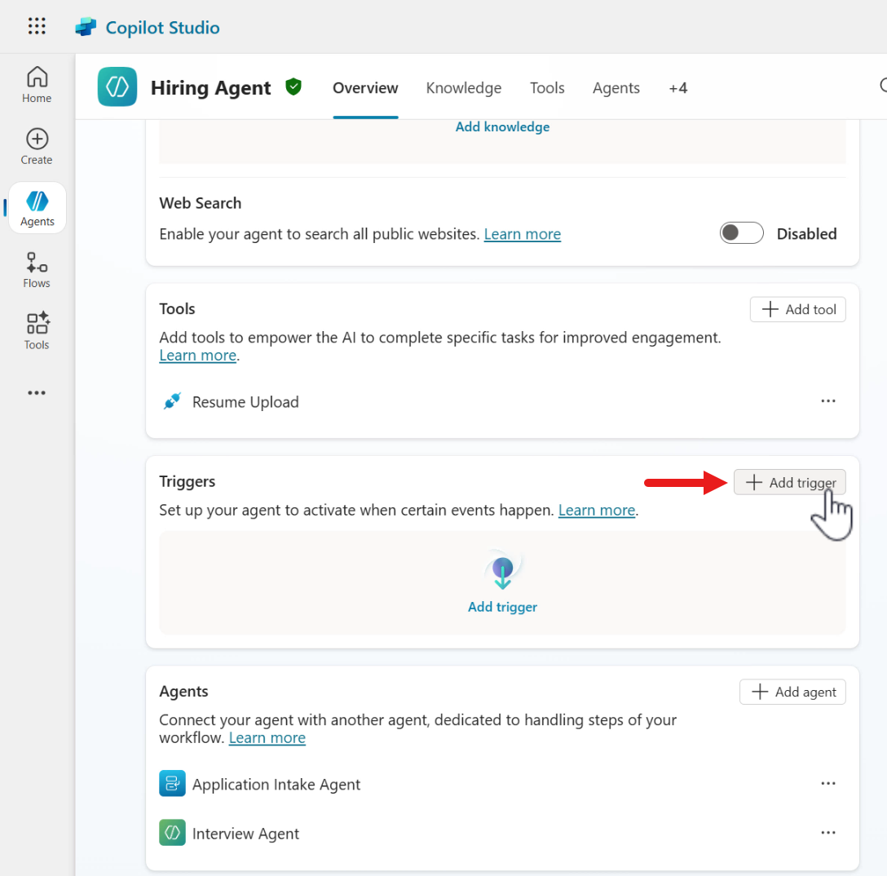

1. A list of triggers will appear. Select **When a new email arrives (V3)** and select **Next**.

       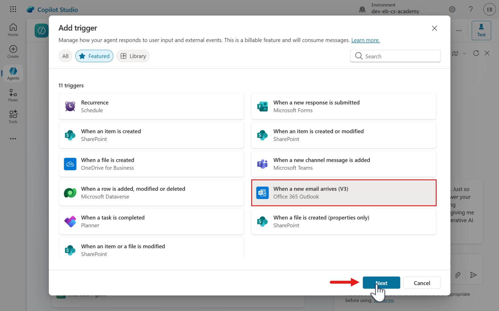

1. We'll now see the **Trigger name** and the **Sign in** connection references for the apps listed..

       Rename the trigger name to the following,
    
       ```text
       When a new email arrives from an applicant
       ```

       Make sure you see a green check by each of the connection references the apps listed. If you don't see a green check, sign in through the ellipsis (...) and select **+ New connection reference** to create a new connection reference.

       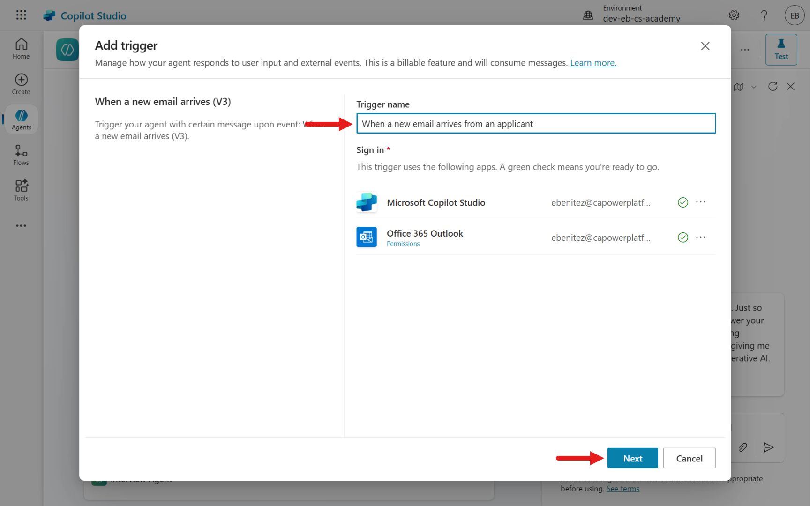

1. The final step is to set the input properties of the trigger. Update the following properties to the following,

     | Property | How to Set | Details |
     |----------|------------|---------|
     | **Include Attachments (Optional)** | Dropdown | Yes |
     | **Subject Filter (Optional)** | Type/Enter with keyboard | Application |
     | **Only with Attachments (Optional)** | Dropdown | Yes |

       Select **Create trigger**.

       

1. Once created, a confirmation message will appear that the trigger has been added to the agent. Select **Close** and the trigger will be listed in the **Triggers** section.

       We're now going to update the event trigger to add some more automation capabilities. Select the **ellipsis (...)** by the trigger and select **Edit in Power Automate**.

       

1. The trigger will then load as a flow in the Power Automate maker portal. What you're seeing is the flow designer in the Power Automate maker portal. This is where we can add further logic and actions for more automation. The trigger will appear at the top, followed by **Sends a prompt to the specified copilot for processing** as the last action in the flow.

       

1. By default, the **When a new email arrives** trigger in Power Automate may process multiple emails together if several arrive at once, running the flow only once for the batch.

       To ensure the flow runs separately for each email, enable the **Split On** setting in the trigger’s settings and select `@triggerOutputs()?['body/value']` in the dropdown array field.

       With **Split On** turned on and the array field set to `@triggerOutputs()?['body/value']`, the flow will run individually for each message, even if many arrive simultaneously.

       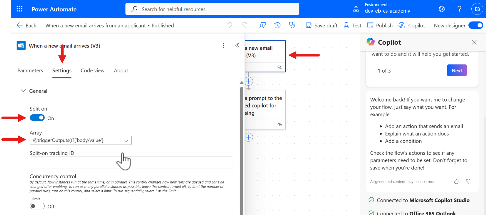

1. Let's next add some logic to check the file type of the attachment, we only want to upload .PDF file attachments and not images (these could come from email signatures). Select the **+** icon below the trigger and select **Control** under the **Built in tools** section.

       

1. Select the **Condition** action.

       

1. Now we configure the condition to check if the file attachment’s type is .PDF. In the **Choose a value** field, select the **lightning bolt icon** or **fx icon** to the right.

       In the **Search** field type the following,

       ```text
       content type
       ```

       Then select the **Attachments Content-Type** parameter from the trigger.

       Next, select **Add** to add the dynamic content input into the **Id** parameter of the action.

       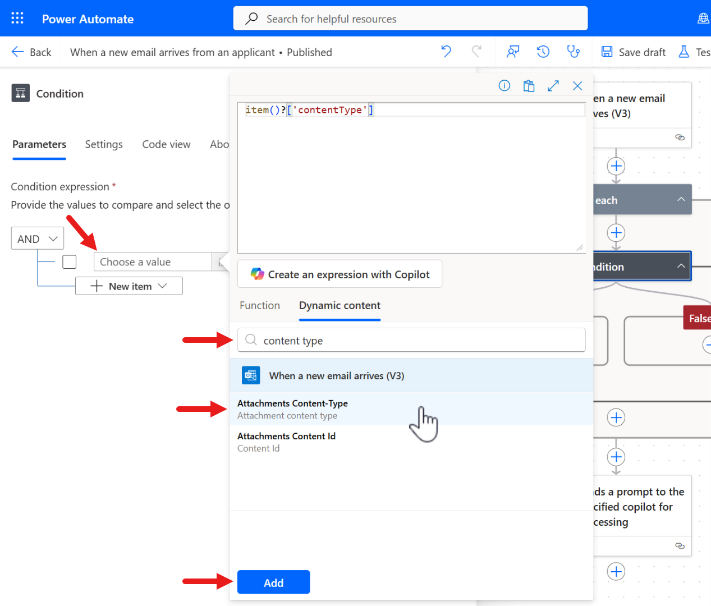

1. Let's pause here for a moment, you probably noticed that the **For each** action automatically appeared.

      Select the **For each** action. This action represents looping through each attachment in the email, since the **Attachments Content-Type** parameter from the trigger is tied to each attachment.

       Underneath the hood, it's an array and that's why the **For each** action was automatically added when we selected the **Attachments Content-Type** parameter in the **Condition** action. To learn more, select this (1) icon. Let's continue!
       { .annotate }

       1.  🤔 Why does "Apply to each" or "For each" Automatically Appear?
           When you select a parameter (dynamic content) that represents a list or array of items - for example, a list of attachments, emails, or rows - Power Automate recognizes that you might want to process each item individually.

           To help you do this, Power Automate automatically adds an **“Apply to each”** (or **For each**) loop around your action. This ensures that your action will run once for every item in the list, rather than trying to process the whole list at once (which could cause errors).

        🦋 Example
           - If you select "Attachments" from a previous action (which is an array), and try to use it in an action that expects a single file, Power Automate wraps your action in an **"Apply to each"** (or **For each**) loop. 
           - This way, your action will run for **each attachment** - one at a time.
           
        💡 Key Points
           - **Automatic:** The loop appears automatically to help you process each item in a collection.
           - **Prevents errors:** Without the loop, your action might fail because it can’t handle multiple items at once.
           - **Visual cue:** It’s a visual way to show that your flow will repeat the action for every item in the list.

       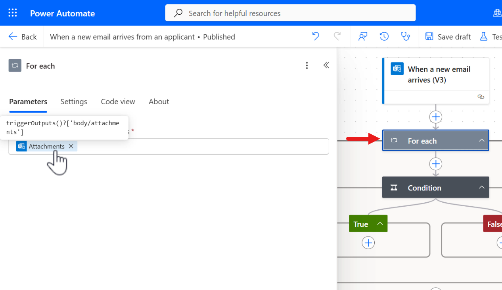

1. Next, in the other **Choose a value** field, type the following,

       ```text
       application/pdf
       ```
       
        This will ensure that for each file attachment, it will check the file extension format is .PDF.

       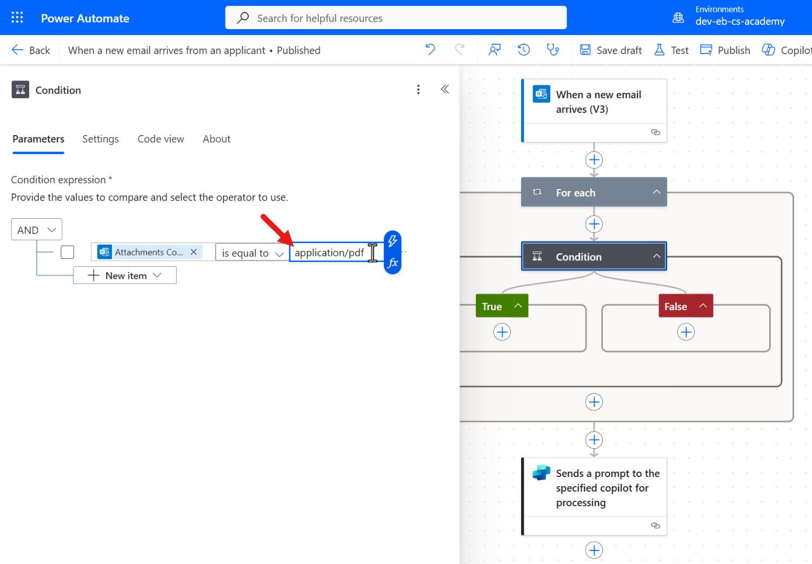

1. Now we'll configure the **True** path to extract the file from the email and upload it into the **Resume** Dataverse table.

       Add a new action below in the **True** path and search for `html to text`. Select the **Html to text** action. To learn more about this action, select this (1) icon.
       { .annotate }

       1.  🤔 What is the "HTML to text" Action?
           The **HTML to text** action in Power Automate is used to convert HTML-formatted content into plain text. This is especially useful when you receive data (like emails, web content, or API responses) that contains HTML tags, and you want to extract just the readable text without any formatting or code.

        ⚙️ How does it work?
           - **Input:** You provide a string of HTML content (for example, the body of an email).
           - **Output:** The action removes all HTML tags and returns only the plain text.
           
        👍🏻 When should you use it?
           - When you want to extract readable text from emails, web pages, or API responses that contain HTML.
           - Before sending content to systems that don’t support HTML formatting (like SMS, Teams messages, or databases).
           - To clean up data for further processing or analysis.
           
        🔭 Where to find it?
           - In Power Automate for in Agent Flows, search for the action called `HTML to text`. It's under the **Data Operations** connector.

        💡 Key points
           - It removes all HTML tags and leaves only the text.
           - It does not interpret or execute scripts/styles - just strips tags.
           - Useful for data cleaning and preparing content for plain-text outputs.

       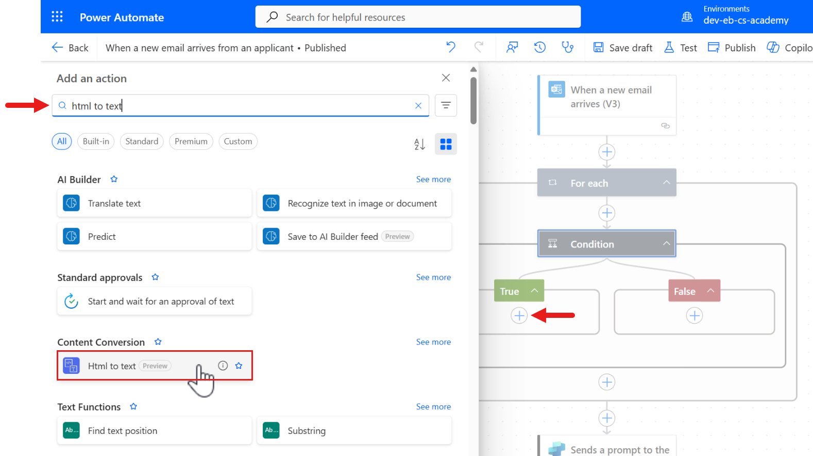

1. Next, we're need to create a new connection reference for the **Html to text** action by selecting **Add new**.

       

1. The action can now be configured. Let's add the **Body** parameter from the trigger. In the **Content** field, select the **lightning bolt icon** or **fx icon** to the right.

       

1. In the **Dynamic content** tab, search for `body` and select the **Body** parameter, followed by selecting **Add**.

       

1. We've completed configuring this action so let's exit from the action by selecting the two angle brackets («) pointing to the left to collapse the panel.

       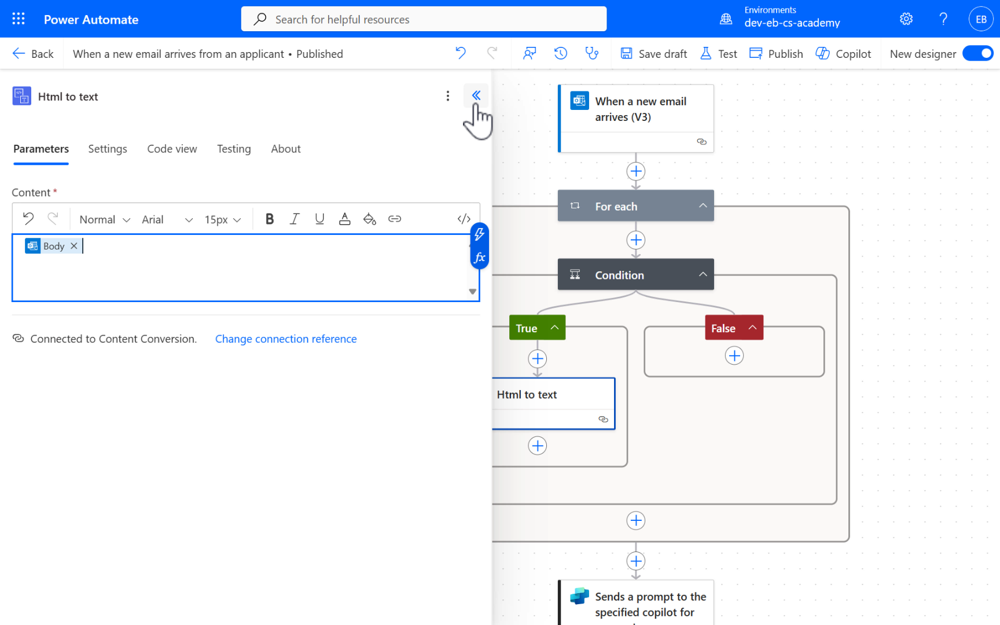

1. We'll add a new action by selecting the **+ icon** underneath the **Html to text** action which will load the panel to add actions. Select the **Microsoft Dataverse** connector.

       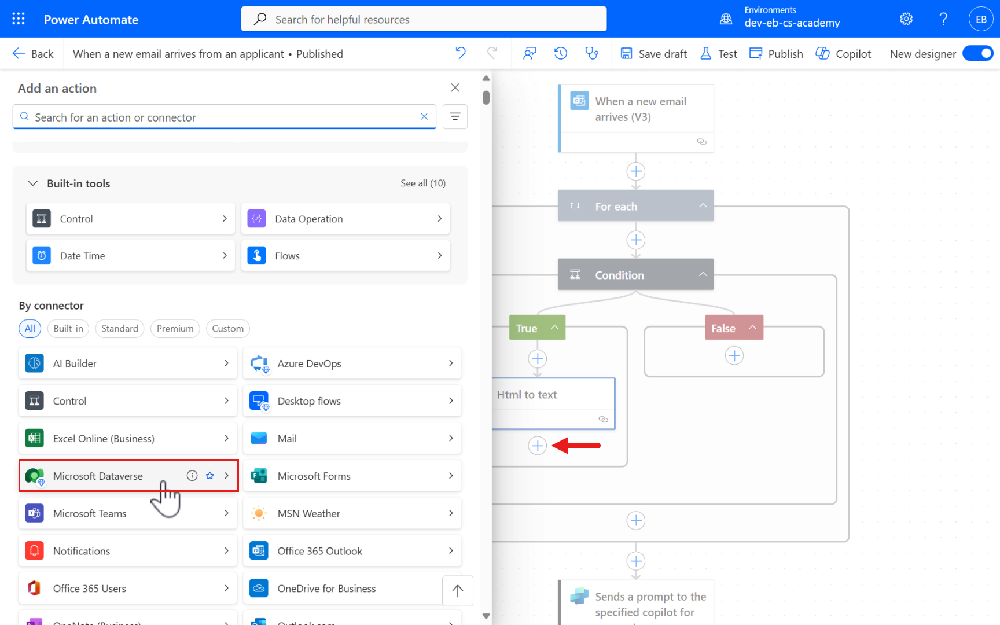

1. Select the **Add a new row** action.

       

1. Rename the action by selecting the **Ellipsis (...)**, copy and paste the following as the name,

       ```text
       Add a new Resume row
       ```

       For the Table name parameter, search for `res` and select the **Resumes** table.

       

1. Select the **Resume Title** field next and select the **lightning bolt icon** or **fx icon** to the right.

       

1. In the **Function tab**, enter the following expression that uses the `item ()` function. To learn more about this function, select this (1) icon.
       { .annotate }

       1.  🤔 What is the `item()` function?
           - `item()` is a function that returns the current item being processed in a loop or array operation.
           - It’s most often used inside actions like **Apply to each** (or **For each**), **Select**, or **Filter array**.
      
        ⚙️ How does it work?
           - When you use an **Apply to each** action, Power Automate goes through each element in a collection (array).
           - Inside that loop, `item()` refers to the _current element_ being processed.

        📌 Where do you use it?
           - **Apply to each:** to access properties of the current item.
           - **Select:** to transform each item in an array.
           - **Filter array:** to reference the curren item being evaluated.

        🦋 Example
           - Expression inside a loop:
               >  `item()?['Email']`
           - This gets the `Email` property of the current item.

        💡 Key points
           - `item()` is _context-sensitive_: it always refers to the current item in the loop or array operation you're in.
           - If you nest loops, you can use `items('LoopName')` to refer to items in a specific loop.

       ```text
       item()?['name']
       ```
      
       Select **Add** to add the expression to the **Resume Title** parameter.

       

1. We still need to configure several more parameters, select **Show all** and in the **Cover Letter** field, select the **lightning bolt icon** or **fx icon** to the right.

       In the **Function tab**, enter the following expression that uses the same expression in the previous [mission](../02-multi-agent/README.md).

       ```text
       if(greater(length(body('Html_to_text')), 2000), substring(body('Html_to_text'), 0, 2000), body('Html_to_text'))
       ```

      This expression checks if the text from the Html to text action is longer than 2000 characters, and if so, returns only the first 2000 characters; otherwise, it returns the full text.

       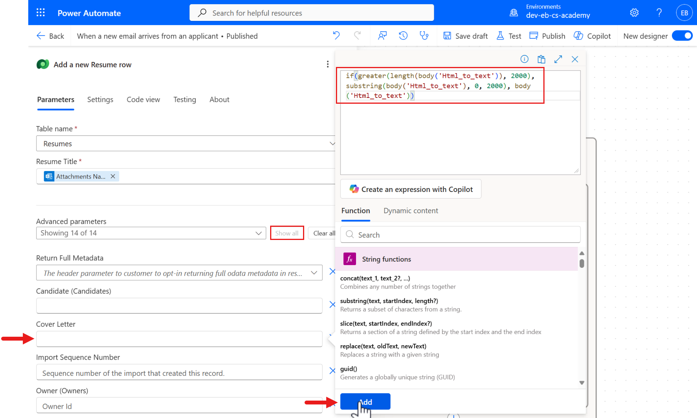

## Lab 3.2 - Automating status report updates

- Make the agents autonomous - by adding triggers:
  - On schedule
  - On incoming email
- [https://learn.microsoft.com/microsoft-copilot-studio/authoring-trigger-event](https://learn.microsoft.com/microsoft-copilot-studio/authoring-trigger-event)
