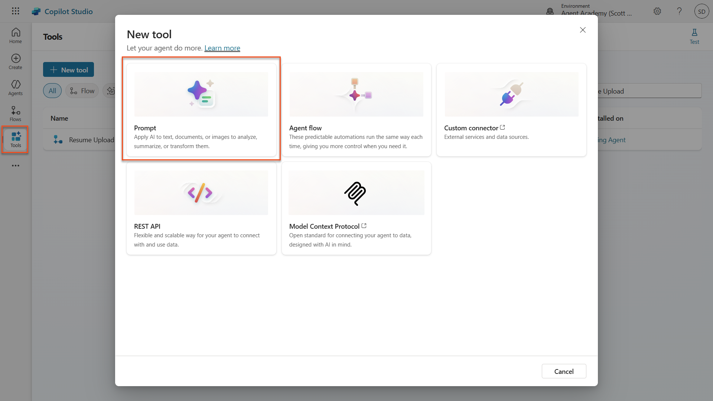
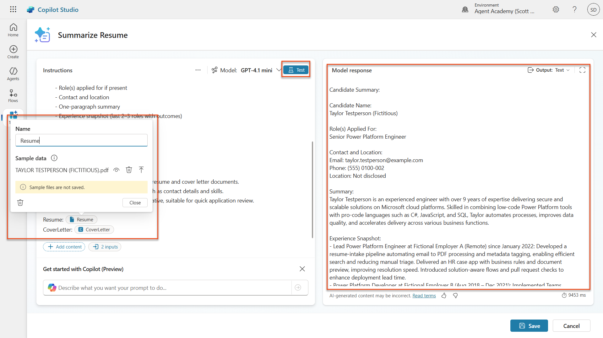
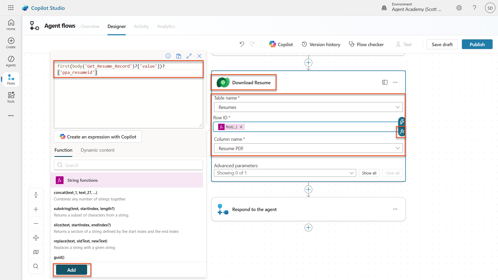
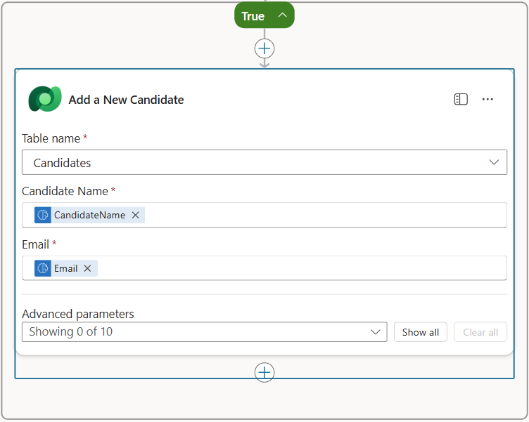
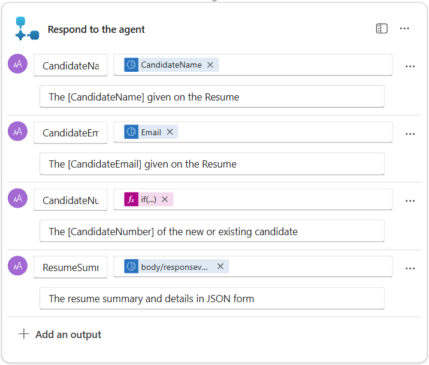
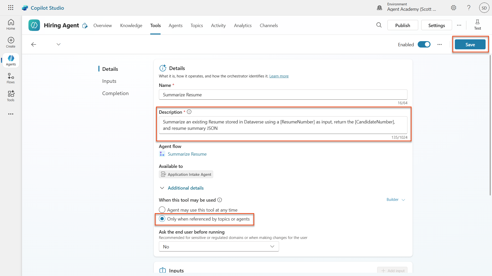
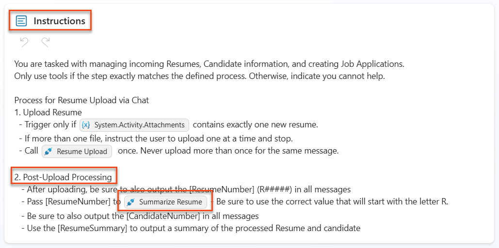
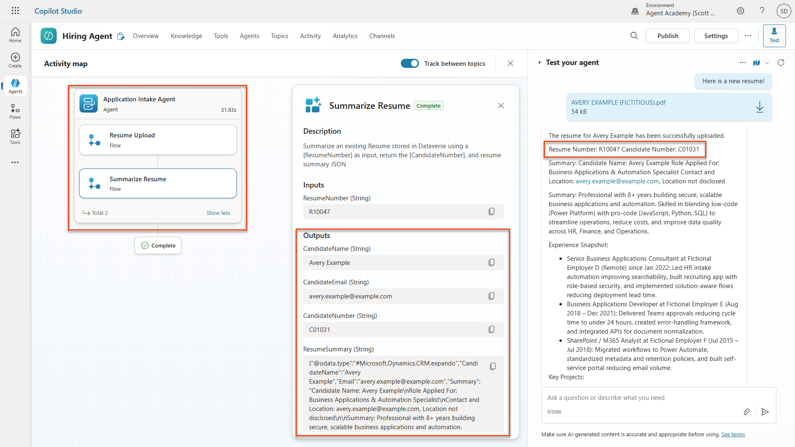
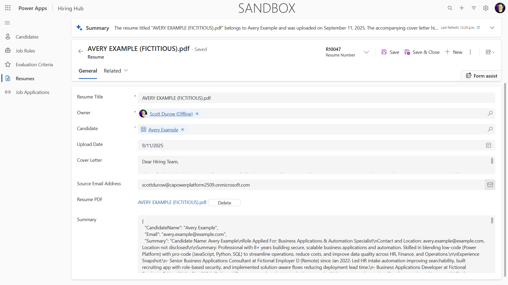

# 🚨 Mission 07: Extracting Resume Contents with Multimodal Prompts

--8<-- "disclaimer.md"

## 🕵️‍♂️ CODENAME: `DOCUMENT RESUME RECON`

> **⏱️ Operation Time Window:** `~45 minutes`

## 🎯 Mission Brief

Welcome, Operative. Your previous missions have equipped you with powerful agent orchestration skills, but now it's time to unlock a game-changing capability: **multimodal document analysis**.

Your assignment, should you choose to accept it, is **Document Resume Recon** - extracting structured data from any document with precision. While your agents can process text with ease, the real world requires handling PDFs, images, and complex documents daily. Resumes pile up, invoices need processing, and forms require instant digitization.

This mission will transform you from a text-only agent builder into a **multimodal expert**. You'll learn to configure AI that reads and understands documents like a human analyst - but with AI speed and consistency. By mission's end, you'll have built a complete resume extraction system that integrates with your hiring workflow.

The techniques you learn here will be essential for the advanced data grounding operations in your next mission.

## 🔎 Objectives

In this mission, you'll learn:

1. What multimodal prompts are and when to use different AI models
1. How to configure prompts with image and document inputs
1. How to format prompt outputs as JSON for structured data extraction
1. Best practices for prompt engineering with document analysis
1. How to integrate multimodal prompts with Agent Flows

## 🧠 Understanding multimodal prompts

### What makes a prompt "multimodal"?

Traditional prompts work with text only. But multimodal prompts can process multiple types of content:

- **Text**: Written instructions and content
- **Images**: Photos, screenshots, charts, and diagrams (.PNG, .JPG, .JPEG)  
- **Documents**: Invoices, resumes, forms (.PDF)

This capability opens up powerful scenarios like analyzing resumes, processing invoices, or extracting data from forms.

### Why multimodal matters for your workflows

Every day, your organization faces these document processing challenges:

- **Resume screening**: Manually reading hundreds of resumes takes valuable time
- **Invoice processing**: Extracting vendor details, amounts, and dates from varied document formats
- **Form analysis**: Converting paper forms into digital data

Multimodal prompts eliminate these bottlenecks by combining AI's language understanding with visual analysis capabilities. This gives your AI the ability to process documents as effectively as text.

### Common business scenarios

Here are some examples of how multimodal prompts can be applied:

| Scenario                | Task                                                                                                                                      | Example Output Fields                                                                                   |
|-------------------------|-------------------------------------------------------------------------------------------------------------------------------------------|---------------------------------------------------------------------------------------------------------|
| **Resume screening**    | Extract candidate name, email, phone, current title, years of experience, and key skills.                                                 | Candidate Name, Email Address, Phone Number, Current Job Title, Years of Experience, Key Skills         |
| **Invoice processing**  | Extract vendor information, invoice date, total amount, and line items from this invoice.                                                 | Vendor Name, Invoice Date, Total Amount, Invoice Line Items                                             |
| **Form analysis**       | Analyze this application form and extract all filled fields.                                                                              | Field Name (e.g., Applicant Name), Entered Value (e.g., John Doe), ...                                  |
| **ID document verification** | Extract name, ID number, expiration date, and address from this identification document. Verify that all text is clearly readable and flag any unclear sections. | Full Name, Identification Number, Expiration Date, Address, Unclear Sections Flag                        |

## ⚙️ Model selection in AI Builder

AI Builder offers different models optimized for specific tasks. Understanding which model to use is crucial for success.

!!! note "Accurate as of September 2025"
    AI Builder models are updated regularly, so check the latest [AI Builder model settings documentation](https://learn.microsoft.com/ai-builder/prompt-modelsettings) for current model availability.

### Model comparison

All of the following models support vision and document processing

| Model | 💰Cost | ⚡Speed | ✅Best for |
|-------|------|-------|----------|
| **GPT-4.1 mini** | Basic (most cost-effective) | Fast | Standard document processing, summarization, budget-conscious projects |
| **GPT-4.1** | Standard | Moderate | Complex documents, advanced content creation, high accuracy needs |
| **o3** | Premium | Slow (reasons first) | Data analysis, critical thinking, sophisticated problem-solving |
| **GPT-5 chat** | Standard | Enhanced | Latest document understanding, highest response accuracy |
| **GPT-5 reasoning** | Premium | Slow (complex analysis) | Most sophisticated analysis, planning, advanced reasoning |

### Temperature settings explained

Temperature controls how creative or predictable your AI responses are:

- **Temperature 0**: Most predictable, consistent results (best for data extraction)
- **Temperature 0.5**: Balanced creativity and consistency  
- **Temperature 1**: Maximum creativity (best for content generation)

For document analysis, use **temperature 0** to ensure consistent data extraction.

## 📊 Output formats: Text vs JSON

Choosing the right output format is critical for downstream processing.

### When to use text output

Text output works well for:

- Human-readable summaries
- Simple classifications
- Content that doesn't need structured processing

### When to use JSON output

JSON output is essential for:

- Structured data extraction
- Integration with databases or systems
- Power Automate flow processing
- Consistent field mapping

### JSON best practices

1. **Define clear field names**: Use descriptive, consistent naming
1. **Provide examples**: Include sample output and values for each field
1. **Specify data types**: Include examples for dates, numbers, and text
1. **Handle missing data**: Plan for null or empty values
1. **Validate structure**: Test with various document types

### Document quality considerations

- **Resolution**: Ensure images are clear and readable
- **Orientation**: Rotate documents to proper orientation before processing
- **Format support**: Test with your specific document types (PDF, JPG, PNG)
- **Size limits**: Be aware of file size restrictions in your environment

### Performance optimization

- **Choose appropriate models**: Upgrade models only when needed
- **Optimize prompts**: Often, shorter, clearer instructions perform better
- **Error handling**: Plan for documents that can't be processed
- **Monitor costs**: Different models consume different amounts of AI Builder credits

## 🧪 Lab 7: Building a resume extraction system

Time to put your multimodal knowledge into practice. You'll build a comprehensive resume extraction system that analyzes candidate documents and transforms them into structured data for your hiring workflow.

### Prerequisites to complete this mission

1. You'll need to **either**:

    - **Have completed Mission 06** and have your multi-agent hiring system ready, **OR**
    - **Import the Mission 07 starter solution** if you're starting fresh or need to catch up. [Download Mission 07 Starter Solution](https://aka.ms/agent-academy)

1. Sample resume documents from [Test Resumes](https://download-directory.github.io/?url=https://github.com/microsoft/agent-academy/tree/main/operative/sample-data/resumes&filename=operative_sampledata)

!!! note "Solution Import and Sample Data"
    If you're using the starter solution, refer to [Mission 01](../01-get-started/README.md) for detailed instructions on how to import solutions and sample data into your environment.

### 7.1 Create a multimodal prompt

Your first objective: create a prompt capable of analyzing resume documents and extracting structured data.

1. Sign in to [Copilot Studio](https://copilotstudio.microsoft.com) and select **Tools** from the left navigation.

1. Select **+ New tool**, then select **Prompt**.  
    

1. **Rename** the prompt from the default timestamp name (E.g. *Custom prompt 09/04/2025, 04:59:11 PM*) to `Summarize Resume`.

1. In the Instructions field, add this prompt:

    ```text
    You are tasked with extracting key candidate information from a resume and cover letter to facilitate matching with open job roles and creating a summary for application review.
    
    Instructions:
    1. Extract Candidate Details:
        - Identify and extract the candidate’s full name.
        - Extract contact information, specifically the email address.
    2. Create Candidate Summary:
        - Summarize the candidate’s profile as multiline text (max 2000 characters) with the following sections:
            - Candidate name
            - Role(s) applied for if present
            - Contact and location
            - One-paragraph summary
            - Experience snapshot (last 2–3 roles with outcomes)
            - Key projects (1–3 with metrics)
            - Education and certifications
            - Top skills (Top 10)
            - Availability and work authorization
    
    Guidelines:
    - Extract information only from the provided resume and cover letter documents.
    - Ensure accuracy in identifying all details such as contact details and skills.
    - The summary should be concise but informative, suitable for quick application review.
    
    Resume: /document
    CoverLetter: /text
    ```

    !!! tip "Use Copilot assistance"
        You can use "Get started with Copilot" to generate your prompt using natural language. Try asking Copilot to create a prompt to summarize a resume!

1. **Configure** the input parameters:

    | Parameter | Type | Name | Sample Data |
    |-----------|------|------|-------------|
    | Resume | Image or document | Resume | Upload a sample resume from the test-data folder |
    | CoverLetter | Text | CoverLetter | Here is a Resume! |

1. Select **Test** to see the initial text output from your prompt.  
    

### 7.2 Configure JSON output

Now you'll convert the prompt to output structured JSON data instead of plain text.

1. Add this JSON format specification to the end of your prompt instructions:

    ```text
    Output Format:
    Provide the output in valid JSON format with the following structure:
    
    {
        "CandidateName": "string",
        "Email": "string",
        "Summary": "string max 2000 characters",
        "Skills": [ {"item": "Skill 1"}, {"item": "Skill 2"}],
        "Experience": [ {"item": "Experience 1"}, {"item": "Experience 2"}],
    }
    ```

1. Change the **Output** setting from "Text" to **JSON**.

1. Select **Test** again to verify the output is now formatted as JSON.  
    

1. **Optional:** Experiment with different AI models to see how outputs vary, then return to the default model.

1. Select **Save** to create the prompt.

1. In the **Configure for use in Agent** dialog, select **Cancel**.

    !!! info "Why we're not adding this as a tool yet"
        You'll use this prompt in an Agent Flow rather than directly as a tool, which gives you more control over the data processing workflow.

### 7.3 Add prompt to an Agent Flow

You'll create an Agent Flow that uses your prompt to process resumes stored in Dataverse.

!!! tip "Agent Flow Expressions"
    It is very important that you follow the instructions for naming your nodes and entering expressions exactly because the expressions refer to the previous nodes using their name! Refer to the [Agent Flow mission in Recruit](../../recruit/09-add-an-agent-flow/README.md#you-mentioned-expressions-what-are-expressions) for a quick refresher!

1. Navigate to your **Hiring Agent** inside Copilot Studio

1. Select the **Agents** tab, and select the child **Application Intake Agent**

1. Inside the **Tools** panel, Select **+ Add** → **+ New tool** → **Agent flow**

1. Select the When an agent calls the flow node, use **+ Add an input** to add the following parameter:

    | Type | Name | Description |
    |------|------|-------------|
    | Text | ResumeNumber | Be sure to use [ResumeNumber]. This must always start with the letter R |

1. Select the **+** Insert action icon below the first node, search for **Dataverse**, select **See more**, and then locate the **List rows** action

1. Select the **ellipsis (...)** on the List rows node, and select **Rename** to `Get Resume Record`, and then set the following parameters:

    | Property | How to Set | Value |
    |----------|------------|-------|
    | **Table name** | Select | Resumes |
    | **Filter rows** | Dynamic data (thunderbolt icon) | `ppa_resumenumber eq 'ResumeNumber'` Replace **ResumeNumber** with **When an agent calls the flow** → **ResumeNumber** |
    | **Row count** | Enter | 1 |

    !!! tip "Optimize those queries!"
        When using this technique in production, you should always limit the columns being selected to only those required by the Agent Flow.

    

1. Select the **+** Insert action icon below the Get Resume Record node, search for **Dataverse**, select **See more**, and then locate the **Download a file or an image** action.

    !!! tip "Pick the correct action!"
        Be sure not to select the action that ends in "from selected environment"

1. As before, rename the action `Download Resume`, and then set the following parameters:

    | Property | How to Set | Value |
    |----------|------------|-------|
    | **Table name** | Select | Resumes |
    | **Row ID** | Expression (fx icon) | `first(body('Get_Resume_Record')?['value'])?['ppa_resumeid']` |
    | **Column name** | Select | Resume PDF |

    

1. Now, select the **+** Insert action icon below Download Resume, under **AI capabilities**, select **Run a prompt**,

1. Rename the action to `Summarize Resume` and set the following parameters:

    | Property | How to Set | Value |
    |----------|------------|-------|
    | **Prompt** | Select | Summarize Resume |
    | **CoverLetter** | Expression (fx icon) | `first(body('Get_Resume_Record')?['value'])?['ppa_coverletter']` |
    | **Resume** | Dynamic data (thunderbolt icon) | Download Resume → File or image content |

    

    !!! tip "Prompt Parameters"
        Notice how the parameters you are filling out are the same ones that you configured as input parameters when you created your prompt.

### 7.4 Create candidate record

Next, you need to take the information that the Prompt gave you and create a new candidate record if it doesn't already exist.

1. Select the **+** Insert action icon below the Summarize Resume node, search for **Dataverse**, select **See more**, and then locate the **List rows** action

1. Rename the node as `Get Existing Candidate`, and then set the following parameters:

    | Property | How to Set | Value |
    |----------|------------|-------|
    | **Table name** | Select | Candidates |
    | **Filter rows** | Dynamic data (thunderbolt icon) | `ppa_email eq 'Email'`  **Replace** `Email` with **Summarize Resume → Email** |
    | **Row count** | Enter | 1 |

    

1. Select the **+** Insert action icon below the Get Existing Candidate node, search for **Control**, select **See more**, and then locate the **Condition** action

1. In the condition properties, set the following condition:

    | Condition | Operator | Value |
    |-----------|----------|-------|
    | Expression (fx icon): `length(outputs('Get_Existing_Candidate')?['body/value'])` | is equal to | 0 |

    

1. Select the **+** Insert action icon in the **True** branch, search for **Dataverse**, select **See more**, and then locate the **Add a new row** action.

1. Rename the node as `Add a New Candidate`, and then set the following parameters:

    | Property | How to Set | Value |
    |----------|------------|-------|
    | **Table name** | Select | Candidates |
    | **Candidate Name** | Dynamic data (thunderbolt icon) | Summarize Resume → `CandidateName` |
    | **Email** | Dynamic data (thunderbolt icon) | Summarize Resume → `Email` |



### 7.5 Update resume and configure flow outputs

Complete the flow by updating the resume record and configuring what data to return to your agent.

1. Select the **+** Insert action icon below the condition, search for **Dataverse**, select **See more**, and then locate the **Update a row** action

1. Select the title to rename the node as `Update Resume`, select **Show all**, and then set the following parameters:

    | Property | How to Set | Value |
    |----------|------------|-------|
    | **Table name** | Select | Resumes |
    | **Row ID** | Expression (fx icon) | `first(body('Get_Resume_Record')?['value'])?['ppa_resumeid']` |
    | **Summary** | Dynamic data (thunderbolt icon) | Summarize Resume → Text |
    | **Candidate (Candidates)** | Expression (fx icon) | `if(equals(length(outputs('Get_Existing_Candidate')?['body/value']), 1), first(outputs('Get_Existing_Candidate')?['body/value'])?['ppa_candidateid'], outputs('Add_a_New_Candidate')?['body/ppa_candidateid'])` |

    

1. Select the **Respond to the agent** node and then use **+ Add an output** to configure:

    | Type | Name              | How to Set                      | Value                                                        | Description                                            |
    | ---- | ----------------- | ------------------------------- | ------------------------------------------------------------ | ------------------------------------------------------ |
    | Text | `CandidateName`   | Dynamic data (thunderbolt icon) | Summarize Resume → See more → CandidateName                  | The [CandidateName] given on the Resume                |
    | Text | `CandidateEmail`  | Dynamic data (thunderbolt icon) | Summarize Resume → See more → Email                          | The [CandidateEmail] given on the Resume               |
    | Text | `CandidateNumber` | Expression (fx icon)            | `concat('ppa_candidates/', if(equals(length(outputs('Get_Existing_Candidate')?['body/value']), 1), first(outputs('Get_Existing_Candidate')?['body/value'])?['ppa_candidateid'], outputs('Add_a_New_Candidate')?['body/ppa_candidateid']) )` | The [CandidateNumber] of the new or existing candidate |
    | Text | `ResumeSummary`   | Dynamic data (thunderbolt icon) | Summarize Resume → See more → body/responsev2/predictionOutput/structuredOutput | The resume summary and details in JSON form            |

    

1. Select **Save draft** on the top right. Your Agent Flow should look like the following  
    

1. Select the **Overview** tab, Select **Edit** on the **Details** panel

    1. **Flow name**:`Summarize Resume`
    1. **Description**:

        ```text
        Summarize an existing Resume stored in Dataverse using a [ResumeNumber] as input, return the [CandidateNumber], and resume summary JSON
        ```

1. Select **Save**

1. Select the **Designer** tab again, and select **Publish**.

### 7.6 Connect the flow to your agent

Now you'll add the flow as a tool and configure your agent to use it.

1. Open your **Hiring Agent** inside Copilot Studio

1. Select the **Agents** tab, and open the **Application Intake Agent**

1. Select the **Tools** panel, and Select **+ Add a tool** - > **Flow** -> **Summarize Resume** **(Agent Flow)**

1. Select **Add and configure**

1. Configure the tool settings as follows:

    | Setting | Value |
    |---------|-------|
    | **Description** | Summarize an existing Resume stored in Dataverse using a [ResumeNumber] as input, return the [CandidateNumber], and resume summary JSON |
    | **When this tool may be used** | Only when referenced by topics or agents |

1. Select **Save**  
    

1. If you select Tools inside the Hiring Agent, you will now see both of our tools showing that they are usable by the **Application Intake Agent**.  
    

1. Navigate to the **Application Intake Child** agent Instructions, and modify the **Post-Upload** step to be the following:

    ```text
    2. Post-Upload Processing  
        - After uploading, be sure to also output the [ResumeNumber] in all messages
        - Pass [ResumeNumber] to /Summarize Resume  - Be sure to use the correct value that will start with the letter R.
        - Be sure to also output the [CandidateNumber] in all messages
        - Use the [ResumeSummary] to output a summary of the processed Resume and candidate
    ```

    Replace `/Summarize Resume` by inserting a reference to the **Summarize Resume agent flow** by typing forward slash (`/)` or selecting `/Summarize` to insert the reference.  
    

1. Select **Save**.

### 7.7 Test your agent

Test your complete multimodal system to ensure everything works correctly.

1. **Start testing**:

    - Select **Test** to open the test panel
    - Type: `Here is a candidate Resume`

    - Upload one of the sample resumes from [Test Resumes](https://download-directory.github.io/?url=https://github.com/microsoft/agent-academy/tree/main/operative/sample-data/resumes&filename=operative_sampledata)

1. **Verify the results**:
    - Once you send the message and resume, check that you receive a Resume Number (format: R#####)
    - Verify you get a Candidate Number and summary
    - Use the activity map to see both the Resume upload tool and Summarize Resume tool in action, and the outputs of the Summary Prompt are received by the agent:  
        

1. **Check data persistence**:
    - Navigate to [Power Apps](https://make.powerapps.com)
    - Open **Apps** → **Hiring Hub** → **Play**
    - Go to **Resumes** to verify the resume was uploaded and processed. It should have both summary information and an associated candidate record.
    - Check **Candidates** to see the extracted candidate information  
        
    - When you run the process again, it should use the existing Candidate (matched on the email extracted from the resume) instead of creating a new one.

!!! tip "Troubleshooting"
    - **Resume not processing**: Ensure the file is a PDF and under size limits
    - **No candidate created**: Check that the email was extracted correctly from the resume
    - **JSON format errors**: Verify your prompt instructions include the exact JSON structure
    - **Flow errors**: Check that all Dataverse connections and expressions are configured correctly

### Production readiness

Although not part of this mission, to make this agent flow production ready you might also consider the following:

1. **Error handling** - If the Resume Number was not found, or the prompt failed to parse the document, error handling should be added to return a clear error to the agent.
1. **Updating existing Candidates** - The candidate is found using the email, then the name could be updated to match that on the resume.
1. **Splitting the Resume summarization and the Candidate creation** - This functionality could be split into smaller agent flows to make them easier to maintain, and then the agent given instructions to use them in turn.

## 🎉 Mission Complete

Excellent work, Operative! **Document Resume Recon** is now complete. You've successfully mastered multimodal prompts and can now extract structured data from any document with precision.

Here's what you've accomplished in this mission:

**✅ Multimodal prompt mastery**  
You now understand what multimodal prompts are and when to use different AI models for optimal results.

**✅ Document processing expertise**  
You've learned to configure prompts with image and document inputs, and format outputs as JSON for structured data extraction.

**✅ Resume extraction system**  
You've built a complete resume extraction system that processes candidate documents and integrates with your hiring workflow.

**✅ Best practices implementation**  
You've applied best practices for prompt engineering with document analysis and integrated multimodal prompts with Agent Flows.

**✅ Foundation for advanced processing**  
Your enhanced document analysis capabilities are now ready for the advanced data grounding features we'll add in upcoming missions.

🚀 **Next up:** In Mission 08, you'll discover how to enhance your prompts with real-time data from Dataverse, creating dynamic AI solutions that adapt to changing business requirements.

⏩ [Move to Mission 08: Enhanced prompts with Dataverse grounding](../08-dataverse-grounding/README.md)

## 📚 Tactical resources

📖 [Create a prompt](https://learn.microsoft.com/ai-builder/create-a-custom-prompt?WT.mc_id=power-power-182762-scottdurow)

📖 [Add text, image, or document input to your prompt](https://learn.microsoft.com/ai-builder/add-inputs-prompt?WT.mc_id=power-182762-scottdurow)

📖 [Process responses with JSON output](https://learn.microsoft.com/ai-builder/process-responses-json-output?WT.mc_id=power-182762-scottdurow)

📖 [Model selection and temperature settings](https://learn.microsoft.com/ai-builder/prompt-modelsettings?WT.mc_id=power-182762-scottdurow)

📖 [Use your prompt in Power Automate](https://learn.microsoft.com/ai-builder/use-a-custom-prompt-in-flow?WT.mc_id=power-182762-scottdurow)

📺 [AI Builder: JSON outputs in prompt builder](https://www.youtube.com/watch?v=F0fGnWrRY_I)
