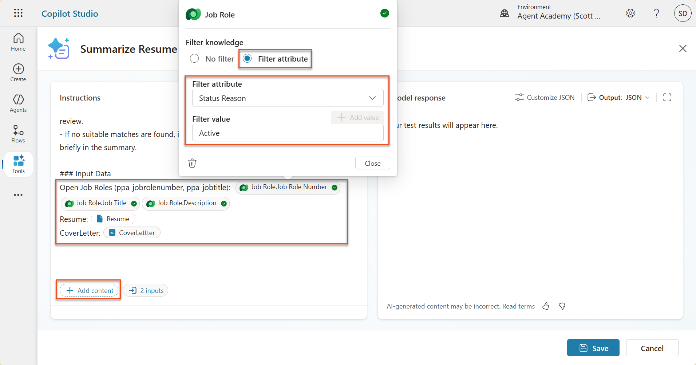
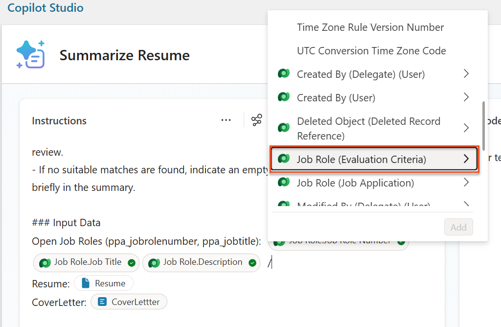
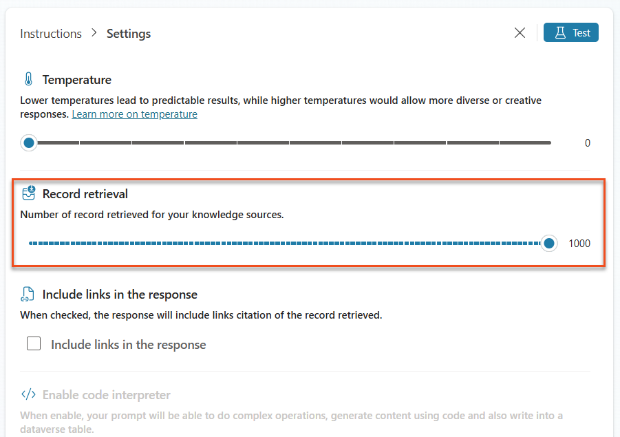
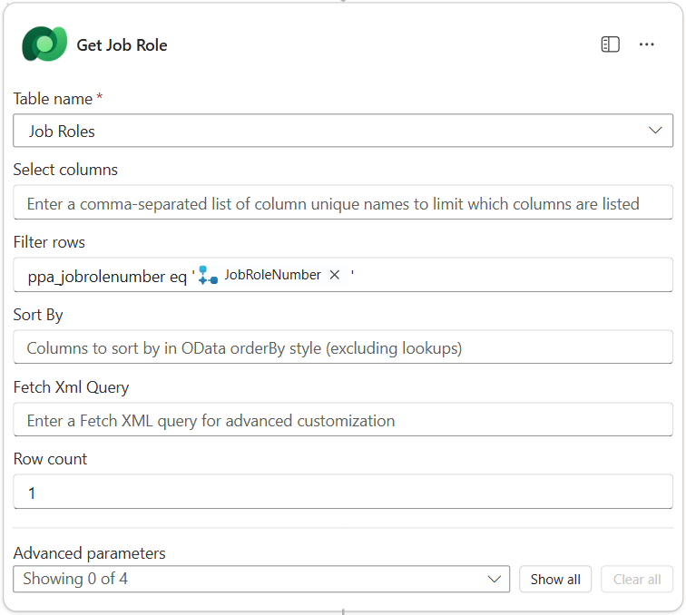
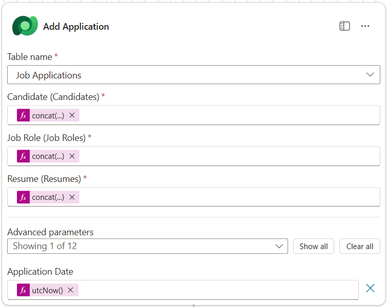
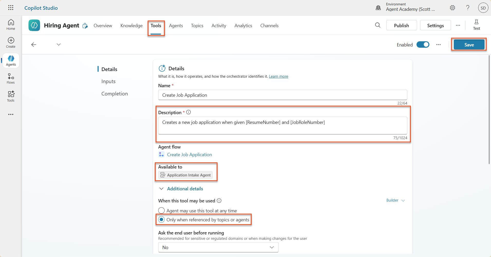
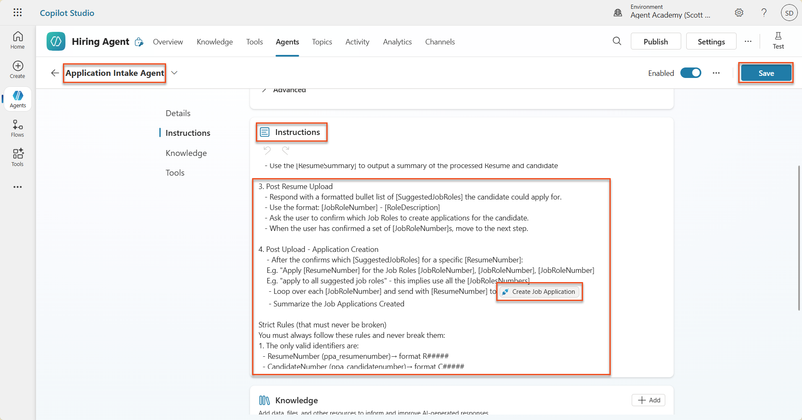
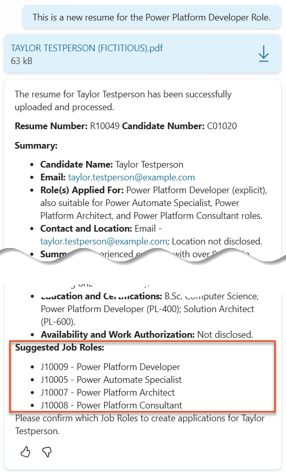
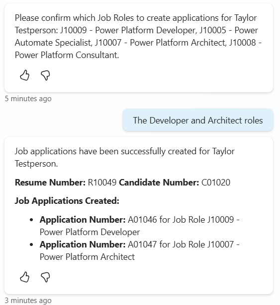
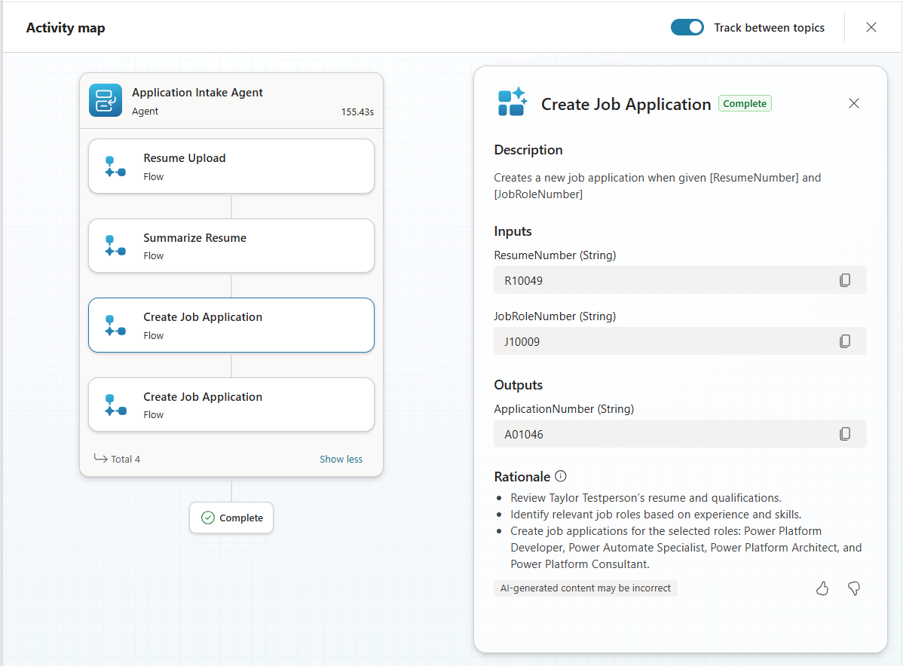

# 🚨 Mission 08: Enhanced prompts with Dataverse grounding

--8<-- "disclaimer.md"

## 🕵️‍♂️ CODENAME: `OPERATION GROUNDING CONTROL`

> **⏱️ Operation Time Window:** `~60 minutes`

## 🎯 Mission Brief

Welcome back, Operative. Your multi-agent hiring system is operational, but there's a critical enhancement needed for **data grounding** - your AI models need real-time access to your organization's structured data to make intelligent decisions.

Currently, your Summarize Resume prompt operates with static knowledge. But what if it could dynamically access your job roles database to provide accurate, up-to-date matches? What if it understood your evaluation criteria without you having to hardcode them?

In this mission, you'll enhance your custom prompt with **Dataverse grounding** - connecting your prompts directly to live data sources. This transforms your agents from static responders to dynamic, data-driven systems that adapt to changing business needs.

Your mission: integrate real-time job role and evaluation criteria data into your resume analysis workflow, creating a self-updating system that stays current with your organization's hiring requirements.

## 🔎 Objectives

In this mission, you'll learn:

1. How **Dataverse grounding** enhances custom prompts
1. When to use data grounding vs static instructions
1. Designing prompts that dynamically incorporate live data
1. Enhancing the Summarize Resume flow with job role matching

## 🧠 Understanding Dataverse grounding for prompts

**Dataverse grounding** allows your custom prompts to access live data from your Dataverse tables when processing requests. Instead of static instructions, your prompts can incorporate real-time information to make informed decisions.

### Why Dataverse grounding matters

Traditional prompts work with fixed instructions:

```text
Match this candidate to these job roles: Developer, Manager, Analyst
```

With Dataverse grounding, your prompt accesses current data:

```text
Match this candidate to available job roles from the Job Roles table, 
considering current evaluation criteria and requirements
```

This approach provides several key benefits:

- **Dynamic updates:** Job roles and criteria change without prompt modifications
- **Consistency:** All agents use the same current data sources
- **Scalability:** New roles and criteria are automatically available
- **Accuracy:** Real-time data ensures decisions reflect current needs

### How Dataverse grounding works

When you enable Dataverse grounding for a custom prompt:

1. **Data selection:** Choose specific Dataverse tables and columns to include. You can also select related tables that the system will filter based on the parent records retrieved.
1. **Context injection:** The prompt automatically includes the retrieved data in the prompt context
1. **Intelligent filtering:** The system includes only data relevant to the current request if you provide any filtering.
1. **Structured output:** Your prompt can reference the retrieved data and reason about the records retrieved to create the output.

### From static to dynamic: The grounding advantage

Let's examine your current Summarize Resume flow from Mission 07 and see how Dataverse grounding transforms it from static to dynamic intelligence.

**Current static approach:**
Your existing prompt included hardcoded evaluation criteria and predetermined matching logic. This approach works but requires manual updates whenever you add new job roles, change evaluation criteria, or shift company priorities.

**Dataverse grounding transformation:**
By adding Dataverse grounding, your Summarize Resume flow will:

- **Access current job roles** from your Job Roles table
- **Use live evaluation criteria** instead of static descriptions  
- **Provide accurate matches** based on real-time requirements

## 🎯 Why dedicated prompts vs agent conversations

In Mission 02, you experienced how the Interview Agent could match candidates to job roles, but required complex user prompts like:

```text
Upload this resume, then show me open job roles,
each with a description of the evaluation criteria, 
then use this to match the resume to at least one suitable
job role even if not a perfect match.
```

While this worked, dedicated prompts with Dataverse grounding offer significant advantages for specific tasks:

### Key advantages of dedicated prompts

| Aspect | Agent Conversations | Dedicated Prompts |
|--------|-------------------|------------------|
| **Consistency** | Results vary based on user's prompt crafting skills | Standardized processing every time |
| **Specialization** | General-purpose reasoning may miss business nuances | Purpose-built with optimized business logic |
| **Automation** | Requires human interaction and interpretation | Triggers automatically with structured JSON output |

## 🧪 Lab 8: Add Dataverse grounding to prompts

Time to upgrade your resume analysis capabilities! You'll enhance the existing Summarize Resume flow with dynamic job role matching.

### Prerequisites to complete this mission

1. You'll need to **either**:

    - **Have completed Mission 07** and have your resume analysis system ready, **OR**
    - **Import the Mission 08 starter solution** if you're starting fresh or need to catch up. [Download Mission 08 Starter Solution](https://aka.ms/agent-academy)

1. Sample resume documents from [test Resumes](https://download-directory.github.io/?url=https://github.com/microsoft/agent-academy/tree/main/operative/sample-data/resumes&filename=operative_sampledata)

!!! note "Solution Import and Sample Data"
    If you're using the starter solution, refer to [Mission 01](../01-get-started/README.md) for detailed instructions on how to import solutions and sample data into your environment.

### 8.1 Add Dataverse grounding to your prompt

You'll build on the Summarize Resume prompt that you created in Mission 07. Currently it simply summarizes the resume, but now you'll ground it with the job roles as they currently exist in Dataverse, keeping it always current.

First, let's examine the Dataverse tables you'll be grounding with:

1. **Navigate** to [Power Apps](https://make.powerapps.com) and select your environment using the **Environment switcher** on the top right of the navigation bar.

1. Select **Tables** and locate the **Job Roles** table

1. Review the key columns you'll use for grounding:

    | Column | Purpose |
    |--------|---------|
    | **Job Role Number** | Unique identifier for role matching |
    | **Job Title** | Display name for the role |
    | **Description** | Detailed role requirements |

1. Similarly, review the other tables such as the **Evaluation Criteria** table.

### 8.2 Add Dataverse grounding data to your prompt

1. **Navigate** to Copilot Studio, and select your environment using the **Environment switcher** on the top right of the navigation bar.

1. Select **Tools** from the left-hand navigation.

1. Choose **Prompt** and locate your **Summarize Resume** prompt from Mission 07.  
    

1. Select **Edit** to modify the prompt, and replace with the enhanced version below:

    !!! important
        Ensure the Resume and Cover Letter parameters remain intact as parameters.

    ```text
    You are tasked with extracting key candidate information from a resume and cover letter to facilitate matching with open job roles and creating a summary for application review.
    
    ### Instructions:
    1. **Extract Candidate Details:**
       - Identify and extract the candidate's full name.
       - Extract contact information, specifically the email address.
    
    2. **Analyze Resume and Cover Letter:**
       - Review the resume content to identify relevant skills, experience, and qualifications.
       - Review the cover letter to understand the candidate's motivation and suitability for the roles.
    
    3. **Match Against Open Job Roles:**
       - Compare the extracted candidate information with the requirements and descriptions of the provided open job roles.
       - Use the job descriptions to assess potential fit.
       - Identify all roles that align with the candidate's cover letter and profile. You don't need to assess perfect suitability.
       - Provide reasoning for each match based on the specific job requirements.
    
    4. **Create Candidate Summary:**
       - Summarize the candidate's profile as multiline text with the following sections:
          - Candidate name
          - Role(s) applied for if present
          - Contact and location
          - One-paragraph summary
          - Top skills (8–10)
          - Experience snapshot (last 2–3 roles with outcomes)
          - Key projects (1–3 with metrics)
          - Education and certifications
          - Availability and work authorization
    
    ### Output Format
    
    Provide the output in valid JSON format with the following structure:
    
    {
      "CandidateName": "string",
      "Email": "string",
      "MatchedRoles": [
        {
          "JobRoleNumber": "ppa_jobrolenumber from grounded data",
          "RoleName": "ppa_jobtitle from grounded data",
          "Reasoning": "Detailed explanation based on job requirements"
        }
      ],
      "Summary": "string"
    }
    
    ### Guidelines
    
    - Extract information only from the provided resume and cover letter documents.
    - Ensure accuracy in identifying contact details.
    - Use the available job role data for matching decisions.
    - The summary should be concise but informative, suitable for quick application review.
    - If no suitable matches are found, indicate an empty list for MatchedRoles and explain briefly in the summary.
    
    ### Input Data
    Open Job Roles (ppa_jobrolenumber, ppa_jobtitle): /Job Role 
    Resume: {Resume}
    Cover Letter: {CoverLetter}
    ```

1. In the prompt editor, replace `/Job Role` by selecting **+ Add content**,  selecting **Dataverse** → **Job Role** and select the following columns, and then select **Add**:

    1. **Job Role Number**

    1. **Job Title**

    1. **Description**

    !!! tip
        You can type the table name to search.

1. In the **Job Role** dialog, select **Filter** attribute, select **Status**, and then type **Active** as the **Filter** value.  
    

    !!! tip
        You can use **Add value** here to add in an input parameter as well - for example if you had a prompt to summarize an existing record, you could provide the Resume Number as a parameter to filter by.

1. Next, you'll add the related Dataverse table **Evaluation Criteria**, by again selecting **+ Add content**, finding **Job Roles**, and instead of selecting the columns on Job Role, expand **Job Role (Evaluation Criteria)** and select the following columns, and then select **Add**:

    1. **Criteria Name**

    1. **Description**  
        

        

    !!! tip
        It is important to select the related Evaluation Criteria by first selecting the Job Role, and then navigating in the menu to Job Role (Evaluation Criteria). This will ensure that only the related records for the Job Role will be loaded.

1. Select **Settings**, and adjust the **Record retrieval** to 1000 - this will allow the maximum Job Roles and Evaluation criteria to be included in your prompt.  
    

### 8.3 Test the enhanced prompt

1. Select the **Resume** parameter, and upload a sample resume that you used in Mission 07.
1. Select **Test**.
1. Once the test has run, notice that the JSON output now includes the **Matched Roles**.
1. Select the **Knowledge used** tab, to see the Dataverse data that merged with your prompt before execution.
1. **Save** your updated prompt. The system will now automatically include this Dataverse data with your prompt when the existing Summarize Resume Agent Flow calls it.  
    

### 8.4 Add Job Application Agent Flow

To allow our Application Intake Agent to create Job Roles based on the suggested roles, we need to create an Agent Flow. The agent will call this tool for each of the suggested job roles that the candidate is interested in.

!!! tip "Agent Flow Expressions"
    It is very important that you follow the instructions for naming your nodes and entering expressions exactly because the expressions refer to the previous nodes using their name! Refer to the [Agent Flow mission in Recruit](../../recruit/09-add-an-agent-flow/README.md#you-mentioned-expressions-what-are-expressions) for a quick refresher!

1. Inside the **Hiring Agent,** select the **Agents** tab, and open the **Application Intake Agent** child agent.

1. Inside the **Tools** panel, select **+ Add** → **+ New tool** → **Agent Flow**

1. Select the **When an agent calls the flow** node, use **+ Add an input** to add the following parameter:

    | Type | Name            | Description                                                  |
    | ---- | --------------- | ------------------------------------------------------------ |
    | Text | `ResumeNumber`  | Be sure to only use the [ResumeNumber] - it MUST start with the letter R |
    | Text | `JobRoleNumber` | Be sure to only use the [JobRoleNumber] - it MUST start with the letter J |

    

1. Select the **+** Insert action icon below the first node, search for **Dataverse**, select **See more**, and then locate the **List rows** action.

1. **Rename** the node as `Get Resume`, and then set the following parameters:

    | Property        | How to Set                      | Value                                                        |
    | --------------- | ------------------------------- | ------------------------------------------------------------ |
    | **Table name**  | Select                          | Resumes                                                      |
    | **Filter rows** | Dynamic data (thunderbolt icon) | `ppa_resumenumber eq 'ResumeNumber'` Select and replace **ResumeNumber** with **When an agent calls the flow** → **ResumeNumber** |
    | **Row count**   | Enter                           | 1                                                            |

    

1. Now, select the **+** Insert action icon below **Get Resume**, search for **Dataverse**, select **See more**, and then locate the **List rows** action.

1. **Rename** the node as `Get Job Role`, and then set the following parameters:

    | Property        | How to Set                      | Value                                                        |
    | --------------- | ------------------------------- | ------------------------------------------------------------ |
    | **Table name**  | Select                          | Job Roles                                                    |
    | **Filter rows** | Dynamic data (thunderbolt icon) | `ppa_jobrolenumber eq 'JobRoleNumber'` Select and replace **JobRoleNumber** with **When an agent calls the flow** → **JobRoleNumber** |
    | **Row count**   | Enter                           | 1                                                            |

    

1. Now, select the **+** Insert action icon below Get Job Role, search for **Dataverse**, select **See more**, and then locate the **Add a new row** action.

1. **Rename** the node as `Add Application`, and then set the following parameters:

    | Property                           | How to Set           | Value                                                        |
    | ---------------------------------- | -------------------- | ------------------------------------------------------------ |
    | **Table name**                     | Select               | Job Applications                                             |
    | **Candidate (Candidates)**             | Expression (fx icon) | `concat('ppa_candidates/',first(outputs('Get_Resume')?['body/value'])?['_ppa_candidate_value'])` |
    | **Job Role (Job Roles)**               | Expression (fx icon) | `concat('ppa_jobroles/',first(outputs('Get_Job_Role')?['body/value'])?['ppa_jobroleid'])` |
    | **Resume (Resumes)**                   | Expression (fx icon) | `concat('ppa_resumes/', first(outputs('Get_Resume')?['body/value'])?['ppa_resumeid'])` |
    | **Application Date** (use **Show all**) | Expression (fx icon) | `utcNow()`                                                   |

    

1. Select the **Respond to the agent node**, and then select **+ Add an output**

     | Property        | How to Set                      | Details                                         |
     | --------------- | ------------------------------- | ----------------------------------------------- |
     | **Type**        | Select                          | `Text`                                          |
     | **Name**        | Enter                           | `ApplicationNumber`                             |
     | **Value**       | Dynamic data (thunderbolt icon) | *Add Application → See More → Application Number* |
     | **Description** | Enter                           | `The [ApplicationNumber] of the Job Application created`      |

     

1. Select **Save draft** on the top right

1. Select the **Overview** tab, Select **Edit** on the **Details** panel

      - **Flow name**:`Create Job Application`
      - **Description**:`Creates a new job application when given [ResumeNumber] and [JobRoleNumber]`
      - **Save**

1. Select the **Designer** tab again, and select **Publish**.

### 8.5 Add Create Job Application to agent

Now you'll connect the published flow to your Application Intake Agent.

1. Navigate back to the **Hiring Agent** and select the **Agents** tab. Open the **Application Intake Agent**, and then locate the **Tools** panel.

1. Select **+ Add**

1. Select the **Flow** filter, and search for `Create Job Application`. Select the **Create Job Application** flow, and then **Add and configure**.

1. Set the following parameters:

    | Parameter                                           | Value                                                        |
    | --------------------------------------------------- | ------------------------------------------------------------ |
    | **Description**                                     | `Creates a new job application when given [ResumeNumber] and [JobRoleNumber]` |
    | **Additional details → When this tool may be used** | `Only when referenced by topics or agents`                   |

1. Select **Save**  
    

### 8.6 Define agent instructions

To create job applications, you need to tell the agent when to use the new tool. In this case, you'll ask the user to confirm which suggested job roles to apply to, and instruct the agent to run the tool for each role.

1. Move back in to the **Application Intake Agent**, and then locate the **Instructions** panel.

1. In the **Instructions** field, **add** the following clear guidance for your child agent to the **end of the existing** instructions:

    ```text
    3. Post Resume Upload
       - Respond with a formatted bullet list of [SuggestedJobRoles] the candidate could apply for.  
       - Use the format: [JobRoleNumber] - [RoleDescription]
       - Ask the user to confirm which Job Roles to create applications for the candidate.
       - When the user has confirmed a set of [JobRoleNumber]s, move to the next step.
    
    4. Post Upload - Application Creation
        - After the user confirms which [SuggestedJobRoles] for a specific [ResumeNumber]:
        E.g. "Apply [ResumeNumber] for the Job Roles [JobRoleNumber], [JobRoleNumber], [JobRoleNumber]
        E.g. "apply to all suggested job roles" - this implies use all the [JobRoleNumbers] 
         - Loop over each [JobRoleNumber] and send with [ResumeNumber] to /Create Job Application   
         - Summarize the Job Applications Created
    
    Strict Rules (that must never be broken)
    You must always follow these rules and never break them:
    1. The only valid identifiers are:
      - ResumeNumber (ppa_resumenumber)→ format R#####
      - CandidateNumber (ppa_candidatenumber)→ format C#####
      - ApplicationNumber (ppa_applicationnumber)→ format A#####
      - JobRoleNumber (ppa_jobrolenumber)→ format J#####
    2. Never guess or invent these values.
    3. Always extract identifiers from the current context (conversation, data, or system output). 
    ```

1. Where the instructions include a forward slash (/), select the text following the / and select the **Create Job Application** tool.

1. Select **Save**  
    

!!! tip "Iterating over multiple items in Generative Orchestration"
    These instructions use generative orchestration's ability to iterate over multiple rows when making decisions about which steps and tools to use. The Matched Job Roles will be automatically read and the Application Intake Agent will run for each row. Welcome to the magical world of generative orchestration!

### 8.7 Test your agent

1. Open your **Hiring Agent** in Copilot Studio.

1. **Upload** a sample resume into the chat, and type:

    ```text
    This is a new resume for the Power Platform Developer Role.
    ```

1. Notice how the agent provides a list of Suggested Job Roles - each with a Job Role number.  
    

1. You can then provide which of these you would like the Resume to be added as a job application for.
    **Examples:**

    ```text
    "Apply for all of those job roles"
    "Apply for the J10009 Power Platform Developer role"
    "Apply for the Developer and Architect roles"
    ```

    

1. The **Create Job Application tool** will then be run for each job role you specified. Inside the Activity map, you will see the Create Job Application tool run for each of the Job Roles you asked to create an application for:  
    

## 🎉 Mission Complete

Outstanding work, Operative! **Operation Grounding Control** is now complete. You've successfully enhanced your AI capabilities with dynamic data grounding, creating a truly intelligent hiring system.

Here's what you've accomplished in this mission:

**✅ Dataverse grounding mastery**  
You now understand how to connect custom prompts to live data sources for dynamic intelligence.

**✅ Enhanced resume analysis**  
Your Summarize Resume flow now accesses real-time job role data and evaluation criteria for accurate matching.

**✅ Data-driven decision making**  
Your hiring agents can now adapt automatically to changing job requirements without manual prompt updates.

**✅ Job Application Creation**  
Your enhanced system can now create Job Applications and is ready for further complex workflow orchestration.

🚀 **Next up:** In your next mission, you'll learn how to implement deep reasoning capabilities that help your agents make complex decisions and provide detailed explanations for their recommendations.

⏩ [Move to Mission 09: Deep reasoning](../09-deep-reasoning/README.md)

## 📚 Tactical Resources

📖 [Use your own data in a prompt](https://learn.microsoft.com/ai-builder/use-your-own-prompt-data?WT.mc_id=power-182762-scottdurow)

📖 [Create a custom prompt](https://learn.microsoft.com/ai-builder/create-a-custom-prompt?WT.mc_id=power-182762-scottdurow)

📖 [Work with Dataverse in Copilot Studio](https://learn.microsoft.com/microsoft-copilot-studio/knowledge-add-dataverse?WT.mc_id=power-182762-scottdurow)

📖 [AI Builder custom prompts overview](https://learn.microsoft.com/ai-builder/prompts-overview?WT.mc_id=power-182762-scottdurow)

📖 [Power Platform AI Builder documentation](https://learn.microsoft.com/ai-builder/?WT.mc_id=power-182762-scottdurow)

📖 [Training: Create AI Builder prompts using your own Dataverse data](https://learn.microsoft.com/training/modules/ai-builder-grounded-prompts/?WT.mc_id=power-182762-scottdurow)
