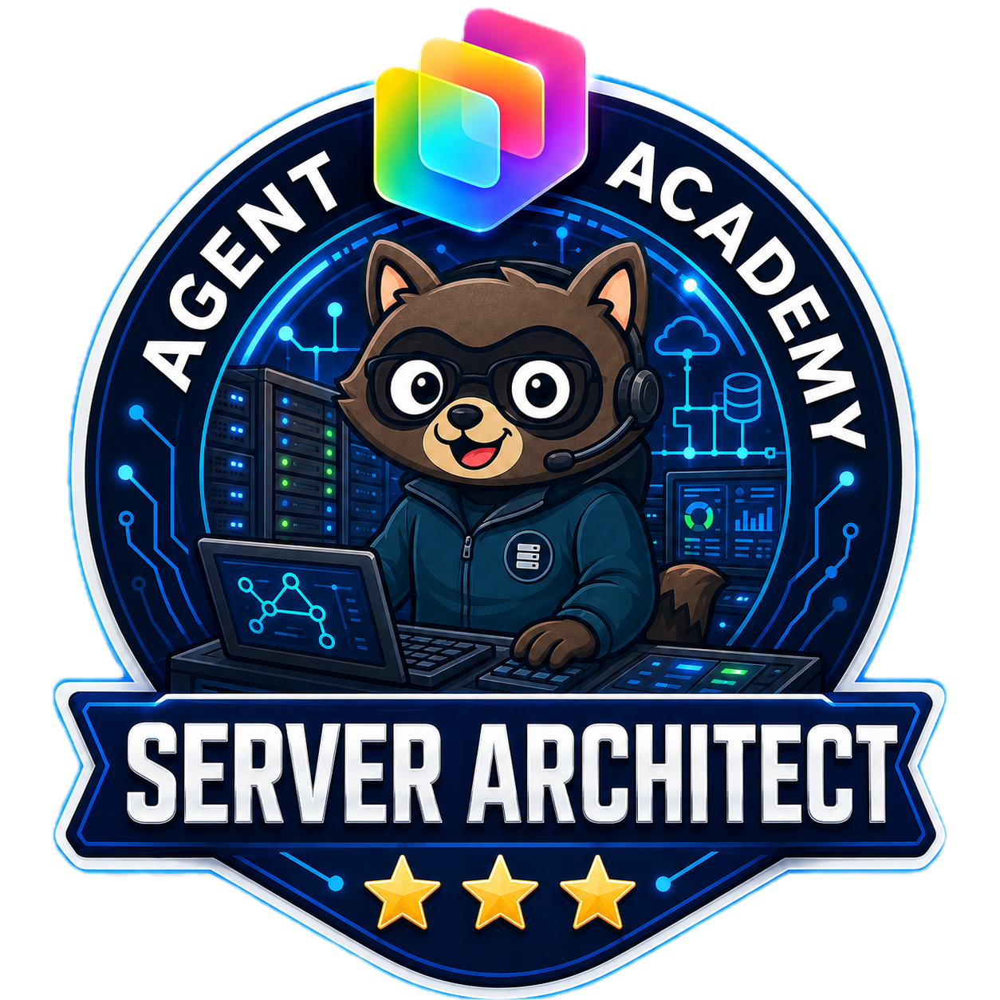

---
tags:
  - mcp
  - custom-skills
  - automation
difficulty: 3
time: 45
harness: github-copilot
preview: true
description: >-
  Build, publish, and consume a scenario-focused Microsoft Graph-backed MCP
  server by using the Microsoft MCP Management Server with the GitHub Copilot harness.
badge: ../assets/Server_Architect_Badge.png
products:
  - copilot-studio
  - github-copilot
  - visual-studio-code
  - microsoft-365
  - power-platform
industries:
  - it
  - hr
created-date: 2026-08-11
last-edited-date: 2026-08-11
---

# 🏗️ Build Your Own MCP Server {#build-your-own-mcp-server}

<mission-meta />

<!-- markdownlint-disable-next-line MD033 -->
<p align="center"></p>

Welcome, agent. Your mission, should you choose to accept it, is to build a
scenario-focused MCP server without writing or hosting server code. You will
use the Microsoft MCP Management Server to assemble a small set of Microsoft
Graph tools, publish the server, and connect it to an agent powered by the
GitHub Copilot harness in Microsoft Copilot Studio.

> [!IMPORTANT] This mission uses the GitHub Copilot harness
> The Copilot Studio steps require an agent powered by the **GitHub Copilot
> harness**. Turn on **New Experience** before you create the agent. GitHub
> Copilot in Visual Studio Code is also used separately to configure and test the
> management server.

Instead of giving your agent every tool in the catalog, you will forge one
purpose-built server named `OnboardingBuddy`. It will expose only the profile,
calendar, and mail capabilities needed for a focused employee onboarding
scenario.

> [!IMPORTANT] Preview feature
> The Microsoft MCP Management Server is a preview feature for agents powered by
> the **GitHub Copilot harness**. Preview tool names, parameters, availability,
> and user interface labels can change. Do not use this mission to configure a
> production environment.

## 🎯 Mission objectives {#mission-objectives}

In this mission, you will learn how to:

- Connect Visual Studio Code to the Microsoft MCP Management Server
- Create a scenario-focused MCP server in a Power Platform environment
- Discover and add Microsoft Graph operations as MCP tools
- Write tool descriptions that help an orchestrator choose the correct tool
- Publish and connect a custom MCP server to an agent powered by the GitHub Copilot harness
- Review governance signals and remove the server after testing

## ⚙️ Prerequisites {#prerequisites}

Before you begin, make sure you have:

- A [Microsoft 365 Copilot license](https://www.microsoft.com/microsoft-365-copilot)
- Access to a Power Platform environment and its
  [environment ID](https://learn.microsoft.com/power-platform/admin/determine-org-id-name)
- A tenant administrator available for the publishing and governance labs
- [Visual Studio Code](https://code.visualstudio.com/download) version 1.118 or later
- Access to GitHub Copilot Chat in Visual Studio Code
- Agent 365 and Work IQ MCP availability in your tenant and region
- A Copilot Studio trial or developer account with access to the **GitHub Copilot harness**

> [!IMPORTANT] GitHub Copilot harness billing
> This mission uses the **GitHub Copilot harness in Microsoft Copilot Studio**,
> which uses usage-based billing. Building, testing in Preview, evaluating, and
> using the agent might consume **Copilot Credits**. Review the
> [Copilot Credits billing overview](https://learn.microsoft.com/microsoft-copilot-studio/agents-experience/billing-credit-overview)
> before you begin.

<!-- Keep adjacent callouts separate for markdownlint. -->

> [!WARNING] Tenant administrator required for publishing
> Only tenant administrators can currently publish custom MCP servers within a
> tenant. If you are not a tenant administrator, you can complete the build and
> tool design labs, then review the remaining steps without publishing.

<!-- Keep adjacent callouts separate for markdownlint. -->

> [!NOTE] Regional availability
> Microsoft 365 admin center controls for custom MCP servers might not be
> available in every region. Work with your administrator if the expected
> controls do not appear.

## 🏭 What is the Microsoft MCP Management Server? {#what-is-mcp-management}

The [Microsoft MCP Management Server](https://learn.microsoft.com/microsoft-copilot-studio/mcp-management)
is an MCP server that creates and manages other MCP servers. Its tools let you
create a server, add tools from supported catalogs, refine those tools, publish
the result, and remove it when it is no longer needed.

Think of MCP as a universal connector for agents. The MCP Management Server is
the **machine shop** where you cut a connector for the one device you need.
Instead of manufacturing and hosting the entire device yourself, you select
approved parts, shape their contracts, and assemble them behind one governed
endpoint.

This API-first approach has no separate design interface. You invoke management
tools from an MCP client such as Visual Studio Code. The tooling gateway then
provides the governance, policy enforcement, and observability needed to make
the resulting server available to supported agent experiences.

### Why build a scenario-focused server? {#why-scenario-focused}

A giant server with dozens of unrelated tools gives an orchestrator more
choices than it needs. Similar names and vague descriptions can make tool
selection less reliable, while broad permissions increase the impact of a
mistake.

A scenario-focused server exposes only the capabilities required for one job.
This design supports least privilege, keeps tool contracts understandable, and
improves the chance that the orchestrator selects the right tool.

| Term | Meaning in this mission |
|------|-------------------------|
| MCP server | A named collection of tools that an agent can discover and invoke |
| Tool | One callable capability, backed here by a Microsoft Graph operation |
| Tooling gateway | The governed Agent 365 layer through which agents invoke MCP tools |
| Publish | Make a custom MCP server available for administrator review and supported clients |
| Block | Prevent clients from using a published server without deleting its definition |
| Delete | Permanently remove the custom MCP server definition |

## 🎯 The scenario {#the-scenario}

Contoso HR wants an onboarding assistant that can answer three common questions:
Who am I? Who is my manager? What meetings do I have tomorrow? The assistant
should also send a welcome message to an onboarding buddy after the employee
confirms the recipient and message.

You will create `OnboardingBuddy`, a custom MCP server that exposes only the
Graph-backed tools needed for this scenario. A focused server keeps the
assistant's toolset small and gives administrators a clear contract to review.

## 🧪 Lab 1.1 - Connect Visual Studio Code {#lab-11-connect-visual-studio-code}

In this lab, you will register the MCP Management Server globally in Visual
Studio Code and confirm that its tools are available.

1. Sign in to the
   [Power Platform admin center](https://admin.powerplatform.microsoft.com/).
1. Select **Manage**, and then select **Environments**.
1. Select the environment that you will use for this mission.
1. Copy the **Environment ID** from the **Details** section.

    <!-- TODO: Add a screenshot of the environment ID in the Details section. -->

1. Open Visual Studio Code.
1. Open the Command Palette by pressing `Ctrl+Shift+P` on Windows or Linux, or
   `Cmd+Shift+P` on macOS.
1. Enter `MCP: Add Server`, and then select **MCP: Add Server**.
1. Select **HTTP (HTTP or Server-Sent Events)** as the server type.
1. Enter the following URL, replacing `{environmentId}` with the environment ID
   that you copied:

    ```text
    https://agent365.svc.cloud.microsoft/mcp/environments/{environmentId}/servers/MCPManagement
    ```

1. Enter `MCPManagement` as the server name.
1. Select **Global** as the configuration target.
1. Sign in with your Microsoft account when prompted.

    <!-- TODO: Add screenshots of the server URL, Global target, and sign-in result. -->

1. Open GitHub Copilot Chat in Visual Studio Code.
1. Enter the following prompt:

    ```text
    Use the MCPManagement server to run GetMCPServers. Summarize the server
    names and their current state. Do not change anything.
    ```

1. Review the tool confirmation, and then approve the `GetMCPServers` call.

> [!TIP]
> If the tools do not appear, run **MCP: List Servers**, select
> `MCPManagement`, and then select **Start Server**.

## 🧪 Lab 1.2 - Forge the server {#lab-12-forge-the-server}

Now create the empty server that will hold the onboarding tools.

1. Enter the following prompt in GitHub Copilot Chat:

    ```text
    Use CreateMCPServer to create a server with these values:

    serverName: OnboardingBuddy
    displayName: Onboarding Buddy
    description: Provides focused Microsoft 365 profile, manager, calendar,
    and welcome-mail tools for employee onboarding.

    Show me the proposed tool call before you run it.
    ```

1. Confirm that `serverName` contains no spaces.
1. Approve the `CreateMCPServer` call.
1. Enter the following prompt:

    ```text
    Run GetMCPServer for OnboardingBuddy and summarize its name, description,
    and current state.
    ```

1. Confirm that the returned description matches the onboarding scenario.

    <!-- TODO: Add a screenshot of the confirmed OnboardingBuddy server. -->

## 🧪 Lab 2.1 - Reconnaissance on Microsoft Graph {#lab-21-graph-recon}

The management server uses catalog identifiers instead of guessed Microsoft
Graph paths. Discover the available operations before adding any tools.

1. Enter the following prompt:

    ```text
    Run GetGraphApisAsync. From the returned catalog, identify the toolId and
    operation name for these onboarding capabilities:

    - Get my user profile
    - Get my manager
    - List my upcoming calendar events
    - Send mail

    Do not create any tools yet. Present the matches in a table and flag any
    capability with more than one plausible operation.
    ```

1. Approve the `GetGraphApisAsync` call.
1. Review each suggested operation and its description.
1. Copy the selected `toolId` values to a temporary note.

    <!-- TODO: Replace this comment with verified catalog results and a screenshot. -->

> [!IMPORTANT]
> Use the `toolId` values returned by your environment. The Graph catalog is a
> preview surface and identifiers can change.

## 🧪 Lab 2.2 - Add profile and manager tools {#lab-22-add-people-tools}

Create two read tools that help an employee understand their reporting context.

1. Replace `[PROFILE_TOOL_ID]` and `[MANAGER_TOOL_ID]` in the following prompt
   with the values returned by `GetGraphApisAsync`:

    ```text
    Add these Microsoft Graph operations to OnboardingBuddy with
    CreateToolWithGraph:

    1. toolId: [PROFILE_TOOL_ID]
       toolName: GetMyProfile
       description: Use when the signed-in employee asks for their own profile
       details. Do not use this tool to search for another employee.

    2. toolId: [MANAGER_TOOL_ID]
       toolName: GetMyManager
       description: Use when the signed-in employee asks who their direct
       manager is or needs their manager's contact details.

    Show each proposed call before running it.
    ```

1. Approve each `CreateToolWithGraph` call.
1. Run `GetTools` for `OnboardingBuddy`.
1. Confirm that `GetMyProfile` and `GetMyManager` appear.

    <!-- TODO: Add a screenshot of the two people tools. -->

## 🧪 Lab 2.3 - Add the calendar tool {#lab-23-add-calendar-tool}

Add one read tool for the employee's upcoming meetings.

1. Replace `[CALENDAR_TOOL_ID]` with the selected calendar operation identifier:

    ```text
    Use CreateToolWithGraph to add this tool to OnboardingBuddy:

    toolId: [CALENDAR_TOOL_ID]
    toolName: GetMyUpcomingMeetings
    description: Use when the signed-in employee asks about upcoming calendar
    events or meetings within a stated date range. Ask for a date range when
    the request does not provide one.
    ```

1. Review the proposed operation and approve the call.
1. Run `GetTool` for `GetMyUpcomingMeetings`.
1. Confirm that the description includes both intent and date-range guidance.

    <!-- TODO: Add a screenshot of the calendar tool details. -->

## 🧪 Lab 2.4 - Add the mail tool {#lab-24-add-mail-tool}

The final tool performs a write action. Its description must tell the
orchestrator when to ask for confirmation.

1. Replace `[MAIL_TOOL_ID]` with the selected mail operation identifier:

    ```text
    Use CreateToolWithGraph to add this tool to OnboardingBuddy:

    toolId: [MAIL_TOOL_ID]
    toolName: SendWelcomeMail
    description: Use only when the signed-in employee asks to send an
    onboarding welcome email. Confirm the recipient, subject, and message body
    with the employee before invoking this tool.
    ```

1. Review the proposed operation and approve the call.
1. Run `GetTools` for `OnboardingBuddy`.
1. Confirm that the server now contains the profile, manager, calendar, and
   mail tools.

    <!-- TODO: Verify that the preview Graph catalog exposes this write operation. -->
    <!-- TODO: Add a screenshot of the completed tool list. -->

> [!WARNING]
> Write operations can affect real tenant data. Use a test recipient and review
> every parameter before approving the mail tool.

## 🧪 Lab 3.1 - Sharpen the tool contracts {#lab-31-sharpen-tool-contracts}

Tool descriptions are instructions for the orchestrator. A precise description
states both when to use a tool and when not to use it.

| Tool | Vague description | Intent-rich description |
|------|-------------------|-------------------------|
| `GetMyManager` | Gets a manager | Use when the signed-in employee asks who their direct manager is or needs their manager's contact details |
| `GetMyUpcomingMeetings` | Gets events | Use when the signed-in employee asks about upcoming meetings within a stated date range; ask for the range when missing |
| `SendWelcomeMail` | Sends email | Use only for an onboarding welcome email; confirm recipient, subject, and body before invoking |

1. Run `GetTools` for `OnboardingBuddy`.
1. Select one tool whose description does not match the table.
1. Run `GetTool` to inspect its current contract.
1. Use `UpdateTool` to replace only its description with the intent-rich version.
1. Run `GetTool` again and confirm that the updated description is returned.

    <!-- TODO: Add before-and-after screenshots for an UpdateTool call. -->

1. If you added an incorrect duplicate during Lab 2, use `DeleteTool` to remove
   it.
1. Run `GetTools` and confirm that only the four intended tools remain.

## 🧪 Lab 3.2 - Publish the server {#lab-32-publish-server}

Publishing makes the server available for tenant governance and supported
clients. A tenant administrator must complete this lab.

1. Ask your tenant administrator to open the MCP-enabled Visual Studio Code
   session.
1. Enter the following prompt:

    ```text
    Use PublishMCPServer to publish OnboardingBuddy. Show the proposed call and
    summarize any permissions or consent required before running it.
    ```

1. Review the proposed action.
1. Approve the publish action.
1. Run `GetMCPServer` for `OnboardingBuddy`.
1. Confirm that the result shows the server as published or pending
   administrator review.

    <!-- TODO: Verify the current PublishMCPServer input schema and response. -->
    <!-- TODO: Add screenshots of the publish and approval states. -->

> [!NOTE]
> If you are not a tenant administrator, stop after reviewing the proposed
> action. Continue with the conceptual walkthrough, but do not expect the
> server to appear in Copilot Studio.

## 🧪 Lab 4.1 - Use the server with the GitHub Copilot harness {#lab-41-use-in-copilot-studio}

Connect the approved server to an agent powered by the GitHub Copilot harness and test orchestration.

1. Go to [Microsoft Copilot Studio](https://copilotstudio.microsoft.com).
1. Turn on **New Experience** if it is not already enabled.
1. Open an existing agent powered by the **GitHub Copilot harness**.
1. Select **Tools**.
1. Select **MCP Server**.
1. Select `OnboardingBuddy` from the registry.
1. Complete the connection setup if prompted.

    <!-- TODO: Add screenshots for the current MCP Server picker and connection flow. -->

1. Open **Test your agent**.
1. Enter the following prompt:

    ```text
    Who is my manager, and what meetings do I have tomorrow?
    ```

1. Confirm that the agent uses the manager and calendar tools.
1. Enter the following prompt:

    ```text
    Draft a short welcome email to my onboarding buddy. Show me the recipient,
    subject, and body for confirmation before you send it.
    ```

1. Confirm the draft only if the recipient and content are safe for testing.
1. Confirm that the agent requests approval before invoking `SendWelcomeMail`.

    <!-- TODO: Add screenshots of the multi-tool response and mail confirmation. -->

## 🧪 Lab 4.2 - Review governance and observability {#lab-42-governance}

An MCP server is not complete until administrators can govern and observe it.

1. Ask a tenant administrator to open the
   [Microsoft 365 admin center](https://admin.cloud.microsoft/).
1. Navigate to **Agents and tools**.
1. Find `OnboardingBuddy`.
1. Review its publisher, status, permissions, and available allow or block
   controls.

    <!-- TODO: Verify the current admin center navigation and add a screenshot. -->

1. Open [Microsoft Defender](https://security.microsoft.com/).
1. Navigate to **Hunting**, and then select **Advanced hunting**.
1. Run a query that filters `CloudAppEvents` for the
   `ExecuteToolByGateway` action.
1. Locate an event generated by the tests in Lab 4.1.
1. Review the agent name, MCP server name, tool name, and invocation time.

    <!-- TODO: Add the verified KQL query and a redacted results screenshot. -->

> [!WARNING]
> Advanced hunting results can contain tenant identifiers and user data.
> Remove sensitive values before capturing screenshots for this mission.

## 🧪 Lab 5.1 - Clean up {#lab-51-clean-up}

Block the server before deleting it so you can confirm that clients can no
longer invoke its tools.

1. Enter the following prompt in the MCP-enabled Visual Studio Code session:

    ```text
    Use BlockMCPServer to block OnboardingBuddy. Show the proposed call before
    you run it.
    ```

1. Approve the block action.
1. Confirm in the Microsoft 365 admin center that the server is blocked.
1. Enter the following prompt:

    ```text
    Use DeleteMCPServer to permanently delete OnboardingBuddy. Show the
    proposed call before you run it.
    ```

1. Review the destructive action, and then approve it.
1. Run `GetMCPServers`.
1. Confirm that `OnboardingBuddy` is no longer returned.

    <!-- TODO: Add screenshots of the blocked state and deletion confirmation. -->

Use **Block** when you need to stop access while preserving the server for
investigation or later reuse. Use **Delete** only when the definition is no
longer needed.

## ✅ Mission accomplished {#mission-accomplished}

You have drafted and assembled a scenario-focused custom MCP server. In this
mission, you:

✅ **Connected the management surface**: Registered the Microsoft MCP
Management Server in Visual Studio Code

✅ **Designed for least privilege**: Limited `OnboardingBuddy` to four
scenario-specific Microsoft Graph tools

✅ **Improved orchestration**: Wrote intent-rich descriptions that guide tool
selection and confirmation

✅ **Applied governance**: Reviewed publishing, blocking, observability, and
cleanup responsibilities

## 🔗 Related content {#related-content}

- [Operative Mission 10: Integrate with MCP Servers](/operative/10-mcp/) -
  Learn MCP fundamentals and connect to Microsoft-provided servers
- [Microsoft Copilot Studio ❤️ MCP](../mcs-mcp/) - Compare this managed,
  API-first approach with building and hosting an MCP server in code
- [Microsoft Learn MCP Server](../ms-learn-mcp/) - Connect a ready-made hosted
  MCP server to an agent

## 🏅 Claim your completion badge {#claim-your-completion-badge}

<!-- TODO: Add the Server Architect badge image and activate the completion form. -->

The **Server Architect** badge and completion form will be added before this
preview mission is published.

## 📚 Tactical resources {#tactical-resources}

- 📖 [Microsoft MCP management MCP server reference](https://learn.microsoft.com/microsoft-copilot-studio/mcp-management)
- 📖 [Work IQ MCP overview](https://learn.microsoft.com/microsoft-agent-365/tooling-servers-overview)
- 📖 [Find your Power Platform environment ID](https://learn.microsoft.com/power-platform/admin/determine-org-id-name)
- 📖 [Use MCP servers in Visual Studio Code](https://code.visualstudio.com/docs/copilot/customization/mcp-servers)
- 📖 [Manage tools for agents in Microsoft 365 admin center](https://learn.microsoft.com/microsoft-365/admin/manage/manage-tools-for-agent)

<analytics-tag section="special-ops" mission="mcp-management-server" />
